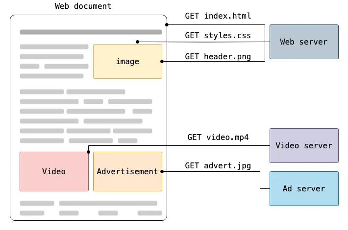
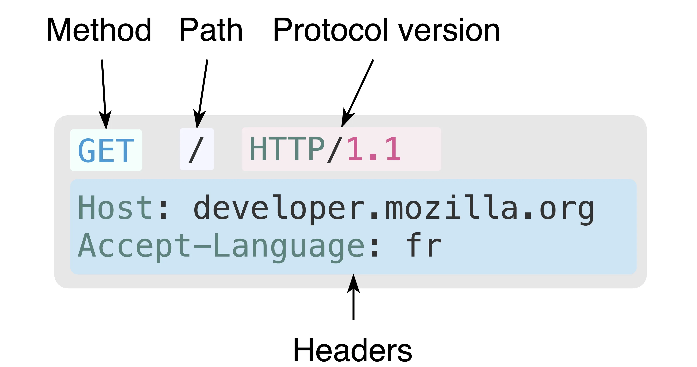
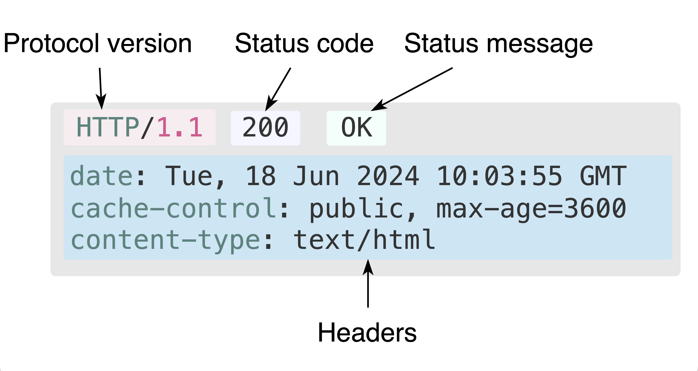
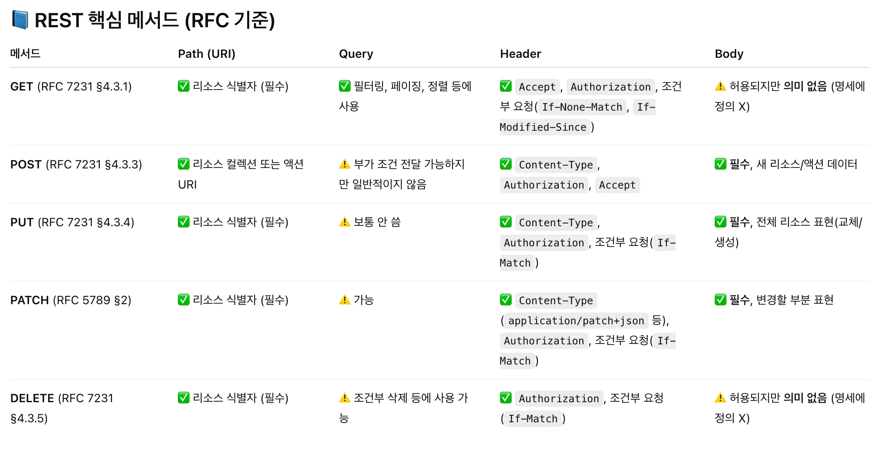
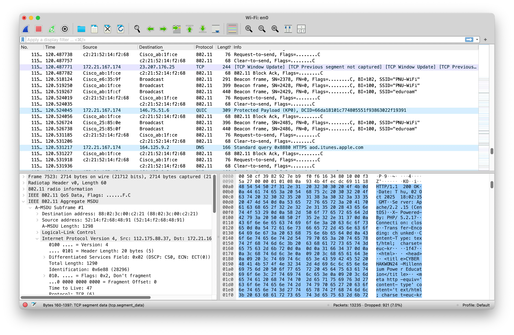
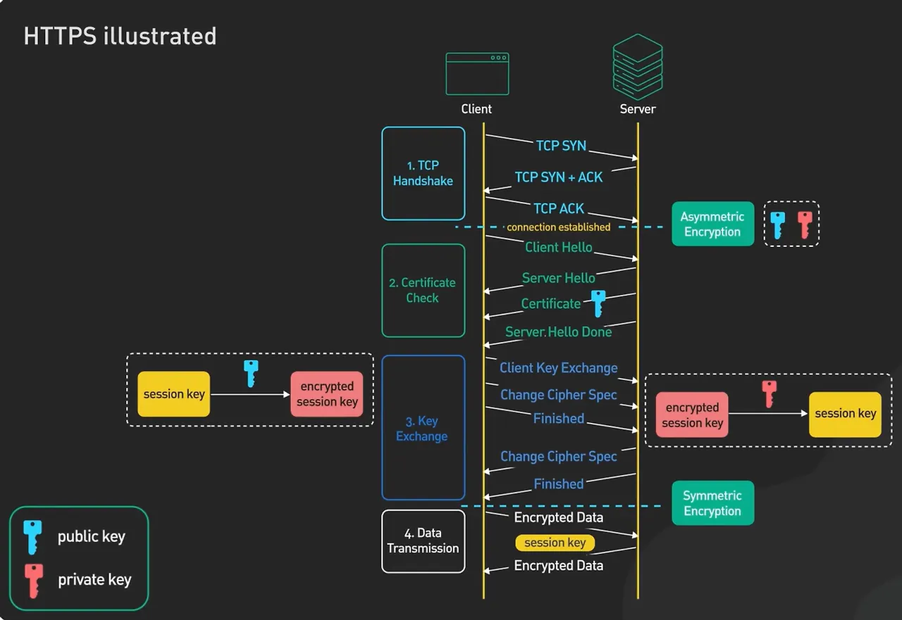

# HTTP(**HyperText Transfer Protocol)**

https://developer.mozilla.org/ko/docs/Web/HTTP/Guides/Overview



## Request



## Response



nc

---

## HTTP Method

https://httpwg.org/specs/rfc9110.html#GET

### HTTP 0.9 (1990)

- **GET : 단순 리소스 조회 (ex: html, css, js 서버에서 가져오기)**

---

### HTTP 1.0 (1996)

https://datatracker.ietf.org/doc/html/rfc1945

- **POST: 리소스 전송 (ex: 작성한 게시글, 댓글 내용 전송 등)**
- HEAD: Body 없이 Head만 전송 요청 (가져올 정보 미리 확인용/네트워크 절약)

---

### HTTP 1.1 (1999)

https://datatracker.ietf.org/doc/html/rfc2616

- **PUT: 리소스 ***전체* ** 수정 (ex: 게시글 수정)**
- **DELETE: 리소스 삭제 요청 (ex: 작성한 게시글 삭제 요청 등)**
- TRACE: 요청이 서버까지 전달되는 경로 확인 (트레이싱)
- OPTIONS: 서버가 지원하는 메서드 목록 확인
- CONNECT: TCP 통신용

---

### PATCH Method for HTTP 2010

https://datatracker.ietf.org/doc/html/rfc5789

- **PATCH: 리소스 ***일부***** **수정 (ex: 사용자 이름 수정)**

### PUT - 사용자의 비밀번호만 바꾸고 싶을 경우에도 사용자 정보 전체를 재 전송해야 함.

```json
PUT /users/1

{
  "name": "홍길순",
  "email": "hong@test.com",
  "age": 20
}
```

### PATCH - 사용자의 비밀번호만 바꾸고 싶을 경우 비밀번호만 전송하면 됨.

```json
PATCH /users/1

{
  "name": "홍길순"
}
```

- 그렇다고 PUT을 쓸일이 없는 것은 아님. → 전체 교체를 보장 / 멱등성

→ 백엔드 개발자가 잘 이해해야함

---

## **HTTP Status Code**

https://developer.mozilla.org/ko/docs/Web/HTTP/Reference/Status

200 OK, 404 Not Found, 500 Internal…

### 1xx - Informational code

정보성 코드, 안쓰임

### 2xx - Successful (정상 처리됨!)

**200 OK:** 요청한 내용을 정상 처리함.

**201 Created:** 요청한 리소스를 정상 생성함. (보통 POST)

**204 No Content:** 요청한 내용을  정상 처리했고, 응답 내용 없음. (DELETE 등)

### 3xx - Redirection(이사 갔음)

**301 Moved Permanently:** 사용자가 요청한 링크가 다른 곳으로 영구적으로 옮겨갔음 (ex: pnu가 bnu로 바뀌었을 경우 [pnu.ac.kr](http://pnu.ac.kr) → [bnu.ac.kr](http://bnu.ac.kr) / [naver.com](http://naver.com) → www.naver.com)

**302 Found:** 일시적 이동 (ex: 사용자가 로그인 한 상태로 로그인 페이지 접속 시, 다시 메인으로 보내줘야 함)

### **4xx - Client Error**

**400 Bad Request:** 잘못된 요청 형식 (ex: 회원가입 시 나이에 -1을 입력해 전송 등)

**401 Unauthorized:** 인증 필요

**403 Forbidden:** 권한 없음 (ex: 관리자용 페이지 등)

**404 Not Found:** 요청한 내용 서버에서 찾을 수 없음

**405 Method Not Allowed:** 지원하지 않는 HTTP Method로 요청함. (ex: 서버는 GET만 지원하는데 POST 요청)

**409 Conflict:** 서버의 상태와 충돌 (ex: 티켓팅 시 누군가 예매한 자리에 또 예매 시도)

**413 Content Too Large:** 너무 길게 보내서 처리 불가

**429 Too Many Requests:** 단 시간 내 ****너무 많이 보내서 서버에 의해 차단된 상태

**401 / 403**:

401은 여기는 접근하려면 인증(로그인)이 필요하다 / 403은 인증은 성공했는데 너는 이걸 볼 권한이 없다. (관리자용 페이지 등)

### 5xx - Server Error

**500 Internal Server Error:** 서버가 요청 처리 중 오류 발생 (서버 로직, 코드상 오류)

**503 Service Unavailable:** 서버가 지금은 처리할 수 없음 (과부하, 점검 등)


# RESTful (Representational State Transfer)

- 모든 것을 리소스(명사) 중심으로 봄. 기존 api들은 행위 중심으로 설계
    
    유저 조회 
    
    - 기존: GET example.com/getUser?id=1
    - REST: GET example.com/user/1
    - 기존: GET example.com/deleteUser?id=1
    - REST: DELETE example.com/user/1

원칙: https://prohannah.tistory.com/156



 https://datatracker.ietf.org/doc/html/rfc7231#section-4.3

### REST 메서드별 응답 규약

### **GET** – [RFC 7231 4.3.1, 7]

- **성공(200 OK)** → 리소스 표현 반환
- 관련 헤더:
    - `Content-Type` → 응답 본문 형식 (예: JSON)
    - `ETag`, `Last-Modified` → 캐싱/조건부 요청용
    - `Cache-Control` → 캐시 정책

---

### **POST** – [RFC 7231 §4.3.3, §7.1.2]

- **성공(201 Created)** → 새 리소스 생성 시
- 관련 헤더:
    - `Location` → 생성된 새 리소스의 URI (필수, 201일 때)
    - `Content-Type` → 응답 본문 형식 (예: JSON)
    - `ETag` → 생성된 리소스 버전(선택)

---

### **PUT** – [RFC 7231 §4.3.4]

- **성공(200 OK 또는 201 Created)**
    - 200 OK → 기존 리소스 교체
    - 201 Created → 새로 생성되었을 경우
- 관련 헤더:
    - `Location` → 새로 생성된 경우 리소스 URI
    - `ETag` → 교체 후 리소스 버전 (선택)

---

### **PATCH** – [RFC 5789 §2.2]

- **성공(200 OK 또는 204 No Content)**
    - 200 OK → 수정된 리소스를 반환
    - 204 No Content → 본문 없이 성공
- 관련 헤더:
    - `ETag` → 수정 후 리소스 버전 (선택)
    - `Location` → 경우에 따라 리소스 URI 제공 가능 (선택)

---

### **DELETE** – [RFC 7231 §4.3.5]

- **성공(200 OK, 202 Accepted, 204 No Content)**
    - 200 OK → 응답 본문에 결과 표현 포함
    - 202 Accepted → 삭제가 비동기적으로 수행될 경우(삭제 중)
    - 204 No Content → 본문 없음, 삭제 완료

# HTTPS


유선 인터넷 → 물리적 도청만 차단하면 OK

무선 인터넷, 모바일 기기 보급 → 카페에서 암호화 되지 않은 HTTP 로그인으로 인해 정보 탈취





https://dkswhdgur246.tistory.com/54

```bash
openssl s_client -connect www.naver.com:443
```