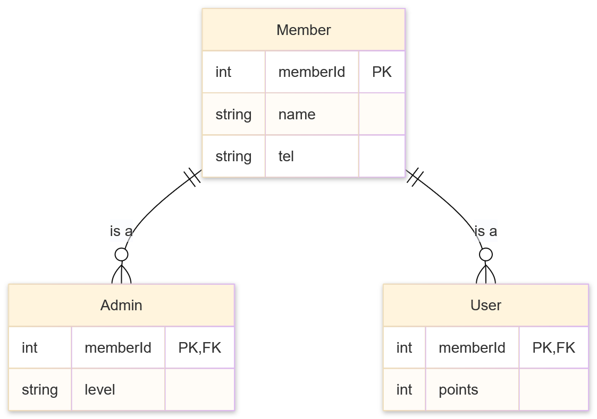

# ORM(JPA)의 필요성 - 2

> ORM 방식을 왜 쓰는지, 썼을 때 어떠한 장점이 있는지 구체적으로 살펴봅시다.

## 객체 중심 모델과 데이터 중심 모델의 패러다임 차이

객체 중심 모델은 객체지향 언어로 개발된 애플리케이션으로, 데이터 중심 모델은 RDBMS로 생각할 수 있습니다.

### 객체지향

- 추상화, 캡슐화, 상속, 다형성을 사용해서 각 모듈의 의존성을 줄이고자 합니다. 

- 속성(필드)와 기능(메소드)를 정의해서 외부에서 세부 동작을 직접 제어하기보다는 객체에게 작업을 시킨다는 관점으로 설계합니다. 

### RDBMS

- 데이터 중심으로 구조화돼 있고, 집합적인 사고를 요구합니다.

- 객체지향 개념에서의 추상화, 상속, 다형성 등의 개념이 존재하지 않습니다.

## 패러다임 차이

객체 중심 모델(객체지향)과 데이터 중심 모델(RDBMS)은 다음과 같은 부분에서 패러다임이 다릅니다.

### 상속

다음과 같은 구조에서 Admin, User 저장 시 sql문을 어떻게 정의해야 할까요?

```java
class Member {
    Long memberId;
    String name;
    String tel;
}

class Admin extends Member {
    String level;
}

class User extends Member {
    int points;
}
```

- DB 구조는 다음과 같이 구성할 수 있습니다.



이 상황에서 Admin 객체를 저장하려면 객체를 분리해서 SQL문을 두 번 수행해야 합니다.

```sql
INSERT INTO MEMBER ...
INSERT INTO ADMIN ...
```

즉, JDBC API를 사용해서 상속된 객체를 저장하려면 부모 객체에서 부모 데이터만 꺼내서 INSERT문을 하나 작성하고, 자식 객체에서 자식 데이터만 꺼내서 INSERT문을 따로 작성해야 합니다.

조회 과정에서도 SELECT 문을 두 번 따로 수행해서 객체를 조합해야겠죠.

자바 컬렉션에서는 다음과 같은 방식으로 단순하게 끝낼 수 있습니다.

```java
ArrayList<Member> list = new ArrayList<>();

list.add(admin);
```

이와 비교해보면 패러다임 불일치로 인한 비용이 높다는 것을 알 수 있습니다.

### 연관관계

- 객체는 참조를 통해 연관된 객체를 조회할 수 있습니다.

```java
class Member {
    private Long memberId;
    private String name;
    private String tel;
    private Team team; // 추가

    public getTeam() {
        return this.team;
    }
}

class Team {
    private Long teamId;
    private String teamName;
}
```

위와 같은 예시에서 Member에 저장된 Team을 member.getTeam()형식으로 가져올 수 있습니다. 단, team객체를 통해 member객체를 조회할 수는 없습니다.

```sql
SELECT M.*, T.*
FROM Member M
JOIN Team T ON M.team_id = T.team_id
```

- 테이블은 외래키(FK)를 사용해서 다른 테이블과 연관관계를 통해 join을 수행함으로써 연관된 테이블을 조회합니다.

위의 두 가지 방식에서 달라지는 부분은 객체에서는 team을 참조로 다루고, RDBMS에는 team의 id를 FK로 설정해서 관리합니다.

```java
class Member {
    private Long memberId;
    private String name;
    private String tel;
    private Long teamId; // 추가

    public getTeam() {
        // ??
    }
}

class Team {
    private Long teamId;
    private String teamName;
}
```

그러면 객체에서도 id를 저장하면 되는 것이 아닌가 생각할 수 있지만, 객체는 JOIN연산이 기본적으로 존재하지 않습니다. 또한 그렇게 진행하면 객체의 참조 기능을 사용하지 못하게 되기에 객체지향의 특성을 잃어버리게 됩니다.

결국 개발자가 참조 방식 접근, FK 기반 접근 사이의 변환 로직을 구현해야 한다는 문제가 생깁니다.

### 객체 그래프 탐색

객체에서 참조를 사용해서 연관된 객체를 찾는 것을 객체 그래프 탐색이라고 합니다.

```
Member ──< Team
   │
   └──< Diary ──< Music ──< Album ──< Artist ...
```

우리는 Member를 통해 객체 그래프를 탐색하길 원합니다.

```java
member.getDiary().getMusic().getAlbum()  ...
```

만약 다음과 같은 SQL문으로 Member를 조회한다면 어떨까요?

```sql
SELECT M.*, D.*
FROM Member M
JOIN Diary D
ON M.diary_id = D.diary_id
```

getDiary()까지는 정상적으로 수행되겠지만, getMusic에서 NullPointerException이 발생하게 됩니다. Music 테이블을 JOIN한 적이 없기 때문이죠.

즉, SQL을 직접 다루면 객체 그래프 탐색 범위를 미리 정해줘야 한다는 문제가 발생합니다.

모든 연관 객체를 조회하는 것은 비용이 비싸기 때문에 결국 Member 조회 메소드를 상황에 따라 여러 벌 만들어서 사용해야 합니다.

```java
memberRepository.getMember();
memberRepository.getMemberWithDiary();
memberRepository.getMemberWithDiaryWithMusic();
...
```

JPA에서는 지연 로딩이라는 기능을 통해 해당 문제를 해결합니다.

## 요약

상속, 연관관계, 객체 그래프 탐색 등의 객체지향의 전형적인 특성이자 장점을 DB 단에서 수행하기 어렵다는 문제가 있습니다.

패러다임 차이로 인해 발생하는 DB와 객체지향 설계 사이의 간극을 좁히기 위해 ORM(Object Relational Mapping)이 등장하게 되었습니다.