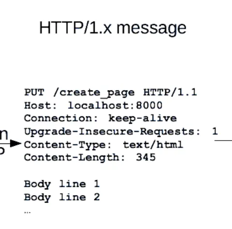

## RequestParam, PathVariable, RequestBody 차이 명확히 구분하기


## 1. Path Parameter (@PathVariable)

- URL 경로의 일부,  보통 리소스의 고유 ID 표현할 때 사용
- RESTful에서 리소스(명사) 중심 설계에 보통 많이 사용함
- ex. [`https://example.com/posts/***123***/comments/***10***`](https://example.com/posts/123/comments/10)

## 2. Query String (Query Parameter/@RequestParam)

- URL ? 뒤에 붙는 key-value 쌍, 이후에는 &로 구
- 조회 시 필터, 정렬, 페이지, 옵션 등 부가적인 정보 전달에 사용.
- URL 자체의 길이 제한이 있음 (서버 설정에 따라 다름)
- ex. `https://example.com/posts?page=1&sort=date`
- 반드시 클라이언트에서 URL Encoding 필요 (URL은 기본적으로 ASCII 문자열만 허용 + ?나 / 등 특수문자 혼동 방지) https://developers.google.com/maps/url-encoding?hl=ko
    - `https://search.naver.com/search.naver?query=ㅎㅇ`
    - `https://search.naver.com/search.naver?query=%E3%85%8E%E3%85%87`
    
    `https://www.coupang.com/vp/products/***8641586809***?pickType=COU_PICK&q=맥북&searchId=bbeb53e62584630&sourceType=search&itemsCount=36&searchRank=1&rank=1&traceId=mgkbzc4i`
    

## 3. Request Body (@RequestBody)

- HTTP 요청의 본문에 데이터를 실어 전달. 보통 POST/PUT/PATCH 등에서 사용
- 구조화된 데이터(JSON, XML, form-data)나 binary(이미지, 단순 파일 등) 전송에 사용
- 반드시 Header에 Content-Type을 통해 내가 전송할 데이터의 형식을 알려주어야 함. 
MIME type https://www.iana.org/assignments/media-types/media-types.xhtml / https://developer.mozilla.org/ko/docs/Web/HTTP/Reference/Headers/Content-Type
- 큰 데이터 전송

```json
POST /users
**Content-Type: application/json**

{
  "name": "홍길동",
  "email": "test@test.com",
  "password": "12345678"
}

```

개발자 도구에서도 3가지 모두 조회 가능

 https://okky.kr/community

### + **URI fragment(Anchor)**

- 브라우저 내에서 특정 영역으로 이동하기 위해 사용(ex. 나무위키)
- 서버로는 전송되지 않음
- `https://example.com/page.html***#section2***`

## Method 별 정리

### 1. GET

Body는 의미 X, Path/QS만 사용
GET에서는 전송할 데이터가 없기에 당연히 전혀 사용 X
사용할 일이 생긴다면 API 설계가 잘된 것인지 확인 필요

ex) 게시글 목록 가져오기 `GET https://example.com/posts?page=1&sort=date`

### 2. POST/PUT/PATCH

모두 사용 가능

ex) 게시글 저장 `POST https://example.com/posts` 

```json
{
	"title": "aaa",
	"content": "bbb",
	...
}
```

ex) 게시글 임시 저장 `POST https://example.com/posts/?draft=true` 

```json
{
	"title": "aaa",
	"content": "bbb",
	...
}
```

### 굳이 Body 없이 Path Parameter나 Query String로 다 보내면 되는 것 아닌가?

1. 일반적인 서버/브라우저는 보통 URL 길이 제한을 가짐 → 큰 데이터 전달에 부적합.



1. 브라우저 방문 기록에는 URL 전체가 기록됨.


3. 서버 로그에도 모두 기록됨.


### → 비밀번호를 Query String으로 담으면?

https://example.com/login?id=admin&pw=q1w2e3


→ 심각한 보안 문제 발생 / 서버 로그에도 평문으로 유출

+ https 사용하지 않으면 body도 평문으로 전송, 중간에서 탈취 가능 (브라우저, 서버 로그에는 남지 않음)

sniffing - https://terms.tta.or.kr/dictionary/dictionaryView.do?word_seq=056077-2