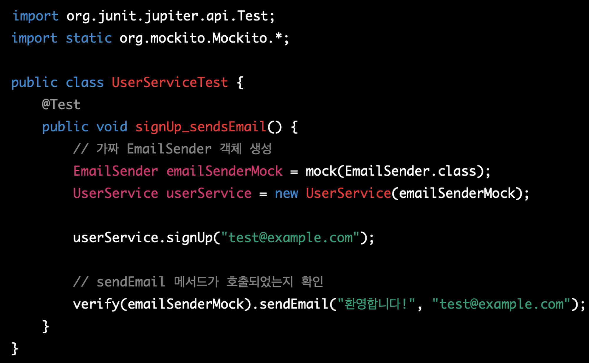
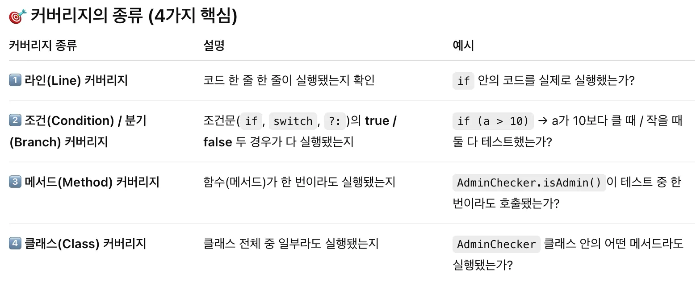
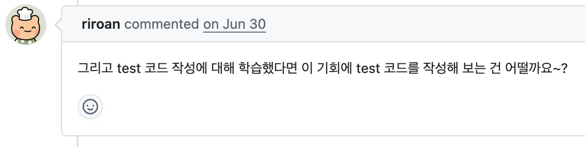
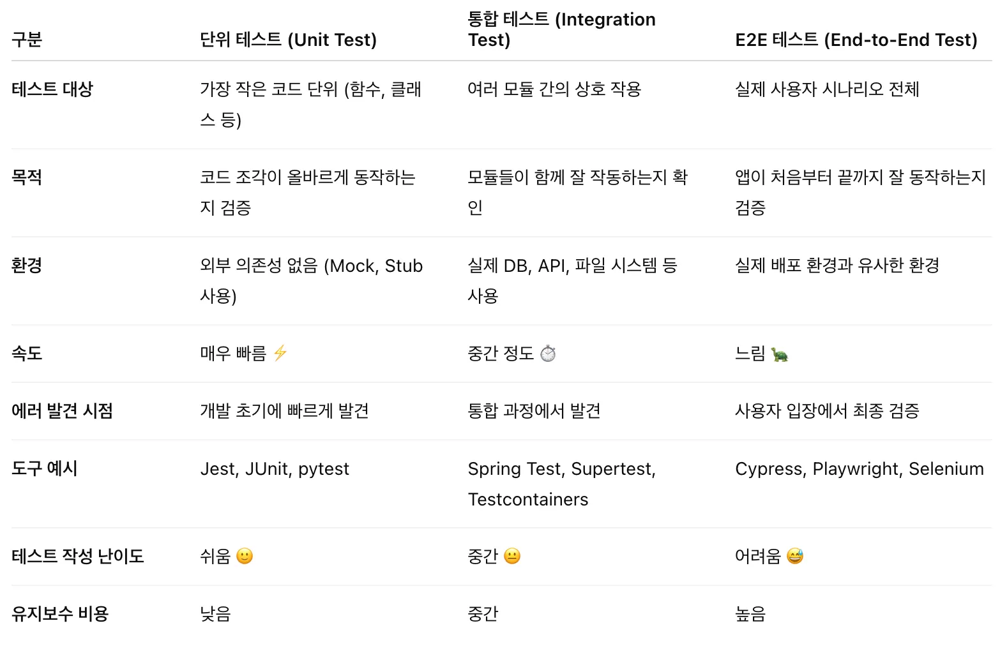
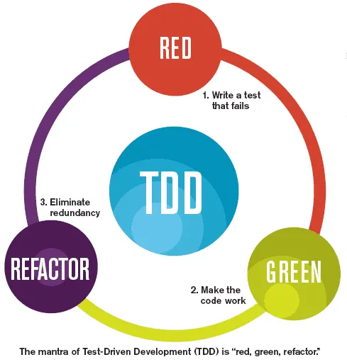
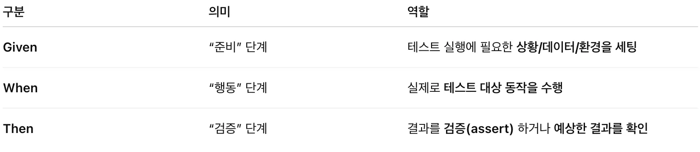

## 테스트 코드란?

- 작성한 코드를 자동으로 검증하기 위해 작성하는 코드


## 테스트 코드가 없다면?

- 계산기 프로그램 제작
    - 실행 → 1+1 넣어보고…  실행 → 2 - 3 넣어보고…. 실행 → 5/0 도 넣어보고….
- 백엔드 게시글 업로드 기능 구현
    - 실행 → Postman으로 요청 → DB 열어서 보고…]
    
    → 귀찮음. 시간 낭비 + 테스트 케이스 누락할 가능성 100% → 갑자기 서버가 죽었어요
    

## 테스트 코드 따라해보기

```java
   public static boolean isAdmin(String email) {
        if ("y.jun0@pusan.ac.kr".equals(email)) {
            return true;
        } else if("admin@pusan.ac.kr".equals(email)){
            return true;
        } else {
            return false;
        }
    }
```

```java
class AdminCheckerTest {

    @Test
    @DisplayName("관리자 이메일(y.jun0@pusan.ac.kr)은 true를 반환해야 한다")
    void testAdminEmailReturnsTrue() {
        assertTrue(Main.isAdmin("y.jun0@pusan.ac.kr"));
    }

    @Test
    @DisplayName("일반 이메일은 false를 반환해야 한다")
    void testNonAdminEmailReturnsFalse() {
        assertFalse(Main.isAdmin("test@example.com"));
    }

    @Test
    @DisplayName("null 값 입력 시 false를 반환해야 한다")
    void testNullEmailReturnsFalse() {
        assertFalse(Main.isAdmin(null));
    }
}
```

## But 테스트 코드에서 휴먼 에러로 테스트를 누락하면?

→ Coverage를 통해 어느정도 잡아낼 수 있음.

### Coverage란?

내가 만든 코드 중, 테스트가 실제로 실행해 본 코드가 얼마나 되는지의 비율




- 모두 100%를 달성하기는 현실적으로 힘듦.

## 테스트코드 작성 시간이 기능 구현보다 오래 걸리는 거 같아요

- 처음에는 테스트코드 작성이 귀찮고 오래 걸림.
    - 나는 기능을 테스트하기 위해 테스트 코드를 짠 건데 기능은 멀쩡한데 테스트 코드에서 버그가 발생
- 하지만 테스트 코드 작성으로 얻을 수 있는 것이 많음.
    - 함수(코드)를 수정/재작성(리팩토링) 하더라도 마음 편하게 고칠 수 있음.
    - 테스트 코드를 통과한다면 일단 잘 작동하는 코드이므로…
        
        → 100%는 아님
        

### 실제 우테코 프리코스 프로그래밍 요구사항


### 카테캠 진행하며 매번 들었던 리뷰



## 테스트코드의 종류



- 단위 테스트: 함수, 클래스 단위 테스트 (개별 테스트 느낌)
- 통합 테스트: DB, 웹, 파일 등 외부 모듈들이랑 모두 연결해 제대로 동작하는지 확인 (상호작용까지 확인)
- E2E(End-to-End) 테스트: 사용자 입장에서 확인/테스트 (Postman)

E2E 테스트는 상대적으로 적게 사용하며, 단위테스트 위주, 필요할 때만 통합 테스트를 추가함.

## TDD(**Test-Driven Development)**란?

https://inpa.tistory.com/entry/QA-%F0%9F%93%9A-TDD-%EB%B0%A9%EB%B2%95%EB%A1%A0-%ED%85%8C%EC%8A%A4%ED%8A%B8-%EC%A3%BC%EB%8F%84-%EA%B0%9C%EB%B0%9C

기능을 구현하기 전 테스트 코드를 먼저 작성해두고, 테스트 코드에 맞추어(통과되도록) 기능을 구현하는 소프트웨어 개발 방법론



### **TDD의 핵심 과정 (Red-Green-Refactor)**

- **Red (빨간색):** 테스트 코드를 먼저 작성. 아직 기능이 구현되지 않았기 때문에 테스트는 실패.
- **Green (초록색):** 작성한 테스트 코드를 통과시킬 수 있는 최소한의 코드를 작성하여 테스트를 성공시킨다.
- **Refactor (리팩토링):** 테스트를 통과한 상태에서 코드를 더 깔끔하고 효율적으로 개선. 중복을 제거 + 구조개선 등..

이 과정을 반복하며 개발해나가는 방식

초기에는 개발 속도가 느릴 수 있으나, 장기적으로는 품질, 생산성 향상.

## 스프링에서의 테스트

단위 테스트 (Unit Test):  메서드나 클래스 단위로 테스트.
    → ex) Service, Repository 단위 테스트

통합 테스트 (Integration Test): 스프링 컨텍스트(빈, DB 등)를 실제로 띄워서 테스트
    → ex) Controller, DB 연동 테스트

Mock 테스트: 외부 의존성 (mock 객체)을 가짜로 대체해서 테스트(@MockBean, Mockito)
    → ex) findByUserId라는 함수를 테스트하고 싶을 경우 가짜 레포지토리 주입하여 테스트 가능

```java
class UserServiceTest {

    @Mockito
    private UserRepository userRepository;  // 가짜 객체

    private UserService userService;

    @Test
    void findUserById_테스트() {
        // given
        when(userRepository.findById(1L))
            .thenReturn(new User("테스트", "test@example.com"));

        // when
        User user = userService.findById(1L);

        // then
        assertThat(user.getName()).isEqualTo("테스트");
    }
}
```

### Given-When-Then?

테스트나 시나리오를 행동(Behavior) 중심으로 구조화하는 표현 방식.

https://brunch.co.kr/@springboot/292



### @SpringBootTest?

https://k-sky.tistory.com/329

```java
@SpringBootTest
class UserServiceTest {
    @Autowired
    private UserService userService;

    @Test
    void testCreateUser() {
        // 스프링 컨텍스트가 전체 로드됨
        userService.createUser(...);
    }
}

```

스프링 부트 어플리케이션 전체(모든 구성요소)를 통째로 띄워서 테스트 할 때 사용.

- 통합 테스트 등에 사용, but 엄청 느림

### @WebMvcTest

https://ksh-coding.tistory.com/53

```java
@WebMvcTest(UserController.class)
class UserControllerTest {

    @Autowired
    private MockMvc mockMvc;  // 가짜 HTTP 요청 도구

    @MockBean
    private UserService userService; // 가짜 서비스 주입

    @Test
    void testGetUser() throws Exception {
        mockMvc.perform(get("/users/1"))
               .andExpect(status().isOk());
    }
}
```

웹 관련 레이어(Controller)만 테스트, 나머지는 Mock(가짜) 처리

- SpringBootTest 보다 훨씬 빠름

---

## 어노테이션 정리

---

## 1. 기본 JUnit & Spring 통합 관련 어노테이션

| 어노테이션 | 설명 | 비고 / 예시 |
| --- | --- | --- |
| `@Test` | 테스트 메서드를 표시 (JUnit 기본) | `@Test void testSomething() {}` |
| `@BeforeEach` / `@AfterEach` | 각 테스트 **전/후**에 실행 | 초기화, 자원 정리 등 |
| `@BeforeAll` / `@AfterAll` | 모든 테스트 **시작 전/후** 한 번만 실행 | static 메서드 필요 |
| `@DisplayName("테스트 설명")` | 테스트 이름을 사람이 읽기 쉽게 표시 | 테스트 리포트 가독성 향상 |
| `@Disabled` | 테스트 비활성화 (임시로 건너뜀) | 예: `@Disabled("수정 중")` |

---

## 2. 스프링 컨텍스트 관련 어노테이션

| 어노테이션 | 설명 | 비고 / 예시 |
| --- | --- | --- |
| `@SpringBootTest` | 스프링 부트 전체 애플리케이션 컨텍스트 로드하여 통합 테스트 | 실제 Bean 전체 로드됨 (무겁지만 현실적인 테스트 가능) |
| `@ContextConfiguration` | 특정 설정 파일 또는 설정 클래스로 컨텍스트 로드 | 스프링 부트 이전 방식 (`SpringTestContext`) |
| `@ActiveProfiles("test")` | 테스트 시 특정 프로필 사용 | application-test.yml 적용 |
| `@TestPropertySource` | 테스트용 프로퍼티 파일 지정 | `@TestPropertySource(locations = "classpath:test.properties")` |

---

## 3. 슬라이스(Slice) 테스트 어노테이션

> 전체 애플리케이션을 띄우지 않고 특정 레이어만 테스트할 때 사용합니다.
> 

| 어노테이션 | 테스트 대상 | 특징 |
| --- | --- | --- |
| `@WebMvcTest(Controller.class)` | **Controller, MVC 관련 빈만** 로드 | Service, Repository는 Mock 필요 |
| `@DataJpaTest` | **JPA Repository** 테스트 | 내장 DB(H2) 자동 설정, 트랜잭션 자동 롤백 |
| `@JdbcTest` | **JDBC 관련** 테스트 | SQL 직접 테스트 |
| `@WebFluxTest` | **WebFlux (Reactive)** 컨트롤러 테스트 | 비동기/리액티브 컨텍스트 |
| `@RestClientTest` | **RestTemplate / WebClient** 통신 테스트 | 외부 API 호출 모킹 용이 |
| `@JsonTest` | **JSON 직렬화/역직렬화** 테스트 | Jackson, Gson 등 설정 테스트 가능 |

---

## 4. Mock 및 의존성 주입 관련 어노테이션

| 어노테이션 | 설명 | 예시 |
| --- | --- | --- |
| `@MockBean` | 스프링 컨텍스트에 Mock 객체 등록 (스프링 빈 대체) | `@WebMvcTest` 등에서 Service 모킹 |
| `@Mock` | Mockito의 Mock 객체 생성 (스프링과 무관) | 단위 테스트용 |
| `@InjectMocks` | Mock 객체를 주입받는 실제 객체 생성 | Service 테스트 등 |
| `@SpyBean` | 스프링 빈을 Spy 객체로 교체 | 실제 동작 + 부분 Mock |

---

## 5. 트랜잭션 및 DB 관련

| 어노테이션 | 설명 |
| --- | --- |
| `@Transactional` | 각 테스트 후 DB 변경 자동 롤백 |
| `@Rollback(false)` | 롤백하지 않고 커밋 (테스트 데이터 유지) |
| `@Sql` | 테스트 전후에 SQL 스크립트 실행 가능 |
| `@AutoConfigureTestDatabase` | 내장 DB or 실제 DB 사용 여부 설정 |

---

## 6. MockMvc / WebTestClient 관련

| 어노테이션 | 설명 |
| --- | --- |
| `@AutoConfigureMockMvc` | `@SpringBootTest`와 함께 사용 시 MockMvc 자동 설정 |
| `@AutoConfigureWebTestClient` | `WebTestClient` 자동 설정 (WebFlux용) |

---