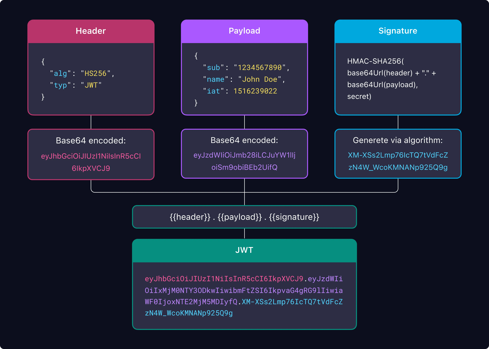
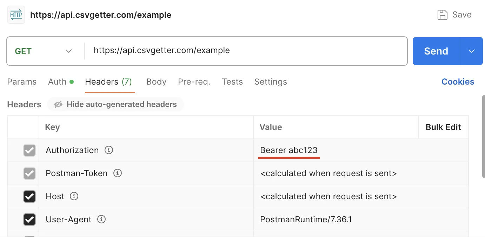
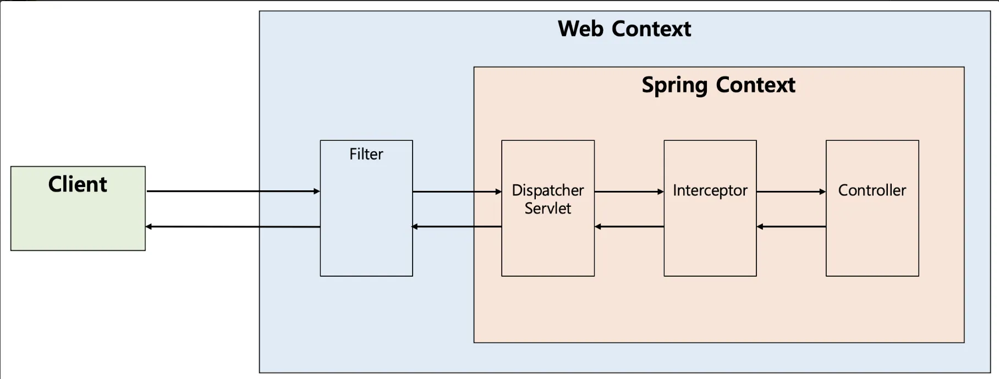
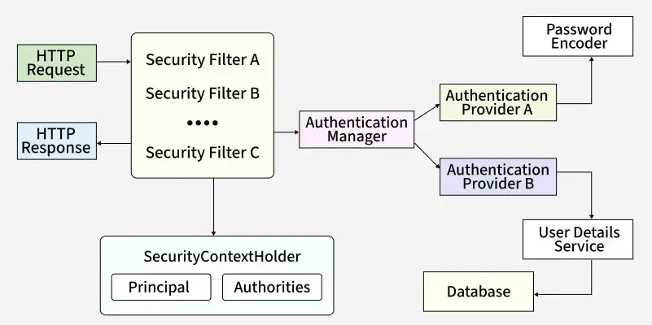

# 4주차 (JWT)

## JWT부터 Spring에서의 인증/인가 간단 구현까지..

# JWT (JSON Web Token)

기존 세션 방식은 인증 정보를 서버가 상태 들고 있어야 하는 구조로, 확장성이 떨어지고 LB 환경에서 구성 번거로움

→ JWT : 인증 정보를 서버가 아닌 클라이언트가 들고 있는 구조.

- Header, Payload, Signature 3가지 데이터를 들고있음.
- 세 부분을 각각 Base64로 인코딩해서 이어붙여 단순 문자열로 만듦(.으로 구분).
- 토큰을 서버에서 만들어서 문자열로 주면, 클라이언트가 저장하고 있다가 매 요청마다 Header의 Autorization에 덧붙여서 전송하는 방식.

### Header

토큰의 기본적인 정보 저장

- alg: Signature를 만들때 어떤 해시 알고리즘 사용했는지 (HS256, RS256)
- typ: “JWT” - JWT임을 명시
- 추가 필드 있으나 거의 사용 X

### Payload

본문. 유저 정보나 만료 시간 같은 내용 저장.

기본 구성 (모두 사용할 필욘 없음)

- iss: 토큰 발급자(issuer)
- sub: 토큰 제목(subject)
- aud: 토큰 대상자(audience)
- exp: 토큰 만료 시간(expiration)
- nbf: 토큰 활성 날짜(not before)
- iat: 토큰 발급 시간(issued at)
- jti: JWT 토큰 식별자(JWT ID)

추가적으로 name, email등 사용자 정의 정보도 저장 가능함.

### Signature

Header, Payload, Secret Key를 합쳐 암호화한 결과값
`HS256(base64UrlEncode(header) + "." + base64UrlEncode(payload), Secret key)`

- 클라이언트 측 저장 → 위조 가능성 : 위조 방지용

### → 서버는 인증 정보 들고 있지 않으면서 위조 가능성도 없는 인증 방식이 완성

https://www.jwt.io/

## AccessToken과 RefreshToken

**기존 방식**

JWT 토큰으로 사용자를 인증하던 중, 사용자의 JWT 토큰이 어떤 방법으로든 유출 될 경우..? (MITM, XSS 등) → 공격자가 무제한으로 사용자의 계정에 접근 가능함.

**해결책**

AccessToken과 RefreshToken 개념을 도입

### AccessToken 이란

- 사용자를 인증하기 위한 **단기성 토큰 (JWT)**
- 서버에 매번 전송하게 됨.
- 유효기간이 매우 짧음(보통 15분 내외)
    
    → 토큰 털려도 피해 최소화 가능
    
    
    

https://velog.io/@oneook/%EC%99%9C-Authorization-Bearer%EC%9D%B8%EA%B0%80%EC%9A%94

### RefreshToken

- AccessToken이 15분만에 만료되면 → 로그인이 풀리고 사용자가 다시 로그인..?
    
    → 불편함
    
- RefreshToken 개념 도입 : AccessToken을 매번 갱신(재발급)할 수 있는 키
    
    → 클라이언트에서 AccessToken 만료 감지 시 RefreshToken을 전송하여 새로운 AccessToken을 가져옴
    
- 만료기간 1년 정도.. (가끔 오래 사용한 앱의 로그인이 풀려있는 이유)
- AccessToken이 만료되었을때만 서버로 전송 : 탈취 위험 적음
- RefreshToken은 JWT 형식일 필요 없이 그냥 무작위 문자열
    - DB에 저장해두고 무작위 문자열을 통해 사용자 식별

### → 사용자가 로그인하면 AccessToken과 RefreshToken 발급. AccessToken으로 서비스 잘 사용하다, 15분마다 RefreshToken 전송해 AccessToken 재발급.

## Spring에서 어떻게 구현?

### Filter

- 스프링 바깥쪽에서 가장 먼저 실행
- 모든 요청을 먼저 가로챔
- 인증/로깅 같은 공통 작업에 적합

### DispatcherServlet

- 메인 엔진
- 이 요청을 어느 컨트롤러가 처리할지 결정

### Interceptor

- 컨트롤러 들어가기 직전에 필요한 작업 처리
- 인증/인가 로직을 두기도 함

### Controller

- 실제 비즈니스 로직 처리하는 곳.
- 요청 받아서 서비스 호출 → 응답 반환.

### 1. Spring Security + Filter로 구현

- Dispatcher Servlet 이전에서 동작
- Spring Security 자체에 대한 이해 어려움
- 작은 규모 프로젝트(단순 회원가입/로그인 구조)에서는 오버 엔지니어링이라는 평
- 처음 세팅만 잘해둔다면 편리하나 처음에는 사용 권장하지 않음

### 2. Interceptor (HandlerInterceptor) 단에서 인증

- Security나 기타 방식에 비해 가볍고 단순.
- 구현 그나마 쉬움

### + Servlet Filter

## HandlerInterceptor를 통한 JWT 인증 구현

[example.zip](./example.zip)