# 트랜잭션의 격리수준 및 정규화

## Cascade? OrphanRemoval?

[JPA CascadeType.REMOVE vs orphanRemoval = true](https://tecoble.techcourse.co.kr/post/2021-08-15-jpa-cascadetype-remove-vs-orphanremoval-true/)

## 트랜잭션

- ~~데이터베이스 강좌를 수강한다면 아는 내용. 빠르게 넘어가기!~~

### 트랜잭션이란?

데이터베이스의 상태를 변환시키는 하나의 논리적인 작업 단위를 구성하는 연산들의 집합

전부 실행되거나, 전부 실행되면 안된다(All or Nothing)

### ACID특성

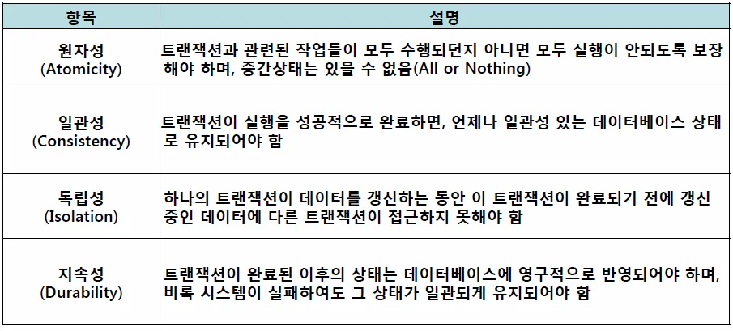

- 일관성 있는 데이터베이스란? - 데이터베이스의 제약조건을 지키면서 추가,수정,삭제가 일어나는 것

### 격리수준이란?

> 여러 트랜잭션이 동시에 처리될 때, 특정 트랜잭션이 다른 트랜잭션에서 변경하거나 조회하는 데이터를 볼 수 있게 허용할지 여부를 결정하는 것 → lock을 어디까지 걸꺼냐?
> 

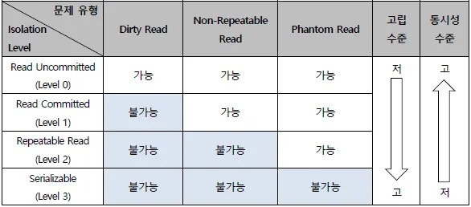

### Read Uncommitted

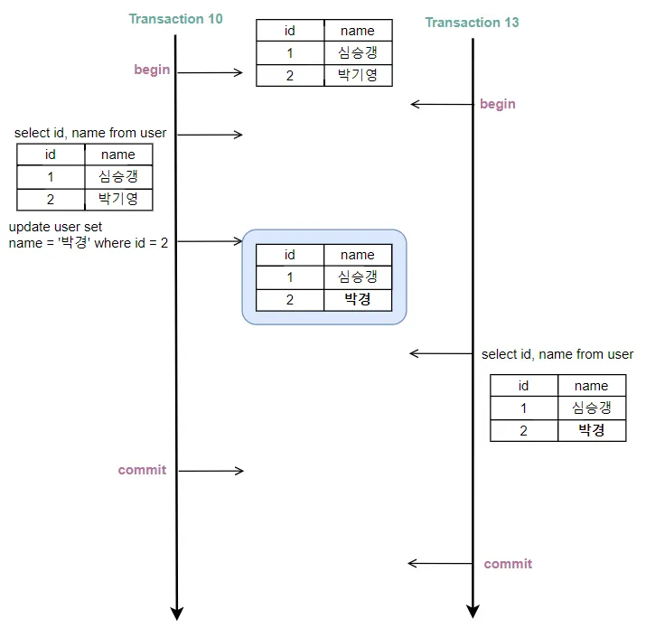

- 각 트랜잭션에서의 변경 내용이 COMMIT이나 ROLLBACK 여부에 상관 없이 다른 트랜잭션에서 값을 읽을 수 있음
- 데이터베이스의 일관성을 유지하는 것이 불가능함

### Dirty Read

- READ UNCOMMITTED에서만 발생!
- 트랜잭션이 커밋되지 않았는데, 다른 트랜잭션에서 해당 작업을 볼 수 있는 현상

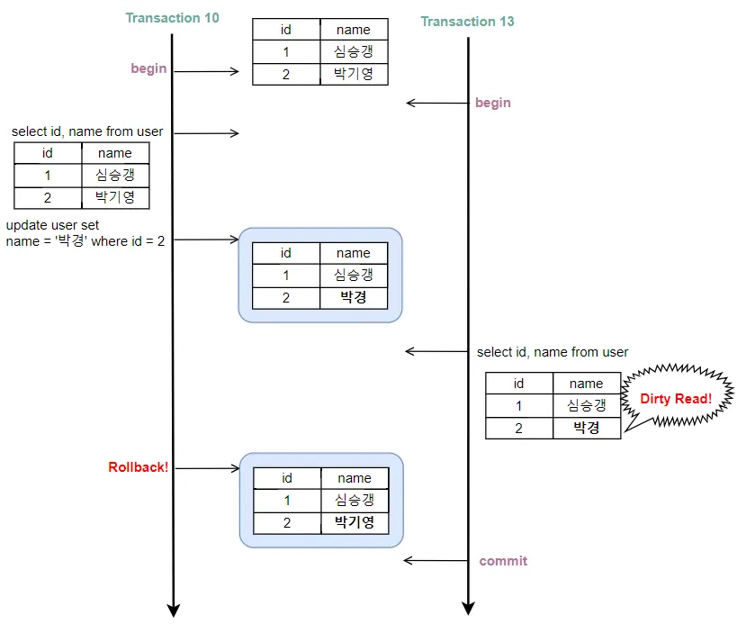

### Read Committed

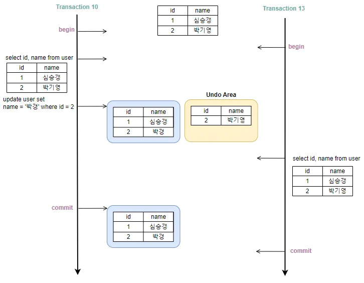

- commit된 데이터만 읽기 가능
- 보통의 RDB에서 default로 사용
- non-repeatable read발생

### Non-Repeatable Read

- READ UNCOMMITTED, READ COMMITTED에서 발생!
- 하나의 트랜잭션 내에서 동일한 SELECT 쿼리를 실행했을 때 항상 같은 결과를 보장해야 한다는 REPEATABLE READ 정합성에 어긋나는 것

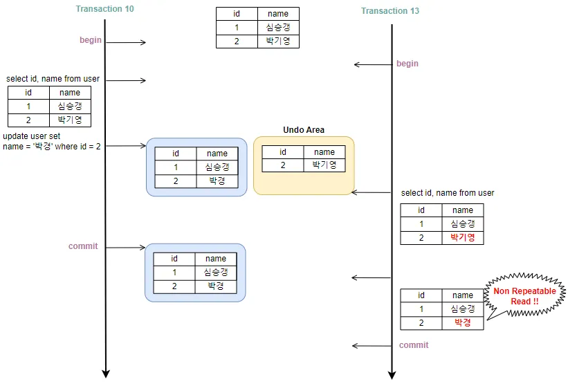

### Repeatable Read

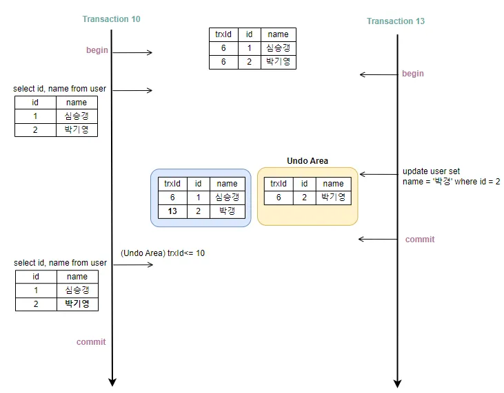

- 자신의 트랜잭션이 생성되기 이전의 트랜잭션에서 COMMIT 이 된 데이터만 읽음
- MySQL과 MariaDB 가 기본으로 사용하는 격리 수준
- 트랜잭션이 범위 내에서 조회한 데이터 내용이 항상 동일함을 보장함

### Phantom Read

- 하나의 트랜잭션 내에서 여러번 실행되는 동일한 SELECT 쿼리에 대해 **결과 레코드 수**가 달라지는 현상
- 이를 방지하기 위해서는 쓰기 잠금을 걸어야 한다.

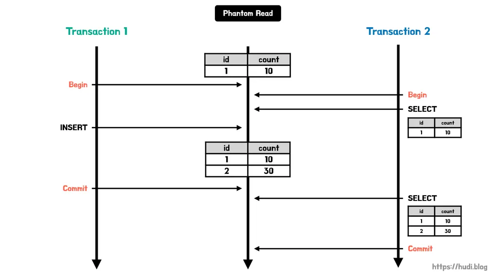

### Serializable

- 가장 엄격한 격리 수준
- 데이터 접근 시, 항상 Lock을 걸고 수행
- 성능 문제로 거의 사용되지 않음…

---

---

## 정규화

### 정규화란?

- 속성을 나누어서 더 좋은 작은 릴레이션으로 분해하는 작업
- 나쁜 릴레이션은 뭔데?
    - 함수적 종속성을 만족하지 않는 릴레이션

### 정규화의 목적?

- 불필요한 데이터, 중복을 최소화하여 디스크 공간을 효율적으로 사용하기 위함.
- 무결성 제약조건을 쉽게 지키기 위해서
- 각종 이상 현상을 방지하기 위해서

- **이상현상**
    - 삭제 이상 - 하나의 자료만 삭제하고 싶지만, 그 자료가 포함된 튜플 전체가 삭제됨으로 원하지 않는 정보 손실이 발생하는 문제점
        - ex) 2101 학번의 홍길동 학생이 ST01 과목을 수강 취소할 경우, 취소 사유를 물을 수 있는 유일한 정보인 연락처마저 잃게 되는것을 의미
        
    - 삽입 이상 - 원하지 않는 자료가 삽입된다든지, 삽입하는데 자료가 부족해 삽입이 되지 않아 발생하는 문제점
        - ex) 2101 학번 홍길동 학생의 연락처만 추가하고 싶을 때, 과목코드가 비게되므로 NULL값을 가져 문제가 발생
        
    - 갱신 이상 - 정확하지 않거나 일부의 튜플만 갱신되어 정보가 모호해지거나 일관성이 없어져 정확한 정보 파악이 되지 않는 문제점
        - ex) 홍길동 학생이 연락처를 바꿨을 경우, ST01, ST02 모두 갱신해야하는데 ST01만 갱신할 경우 발생

## 함수적 종속성이란?

> "A이면 B이고 동시에 A이면 C일 수 없지만, B이면 반드시 A인 것은 아니다.”
> 

예시!

학번과 이름 

- 학번이 정해지면 그 이름은 하나로 정해짐.
    - 즉, 학번이 정해지면 자동으로 이름을 특정할 수 있음
    - 이런 경우, 함수적 종속성이 성립함

- 하지만, 이름을 정했다고 해서 학번을 정할 수는 없을 수 있음!
    - 동명이인이 있다면, 학번이 여러개일 수 있음
    - 이런 경우, 함수적 종속성이 성립하지 않음!
    

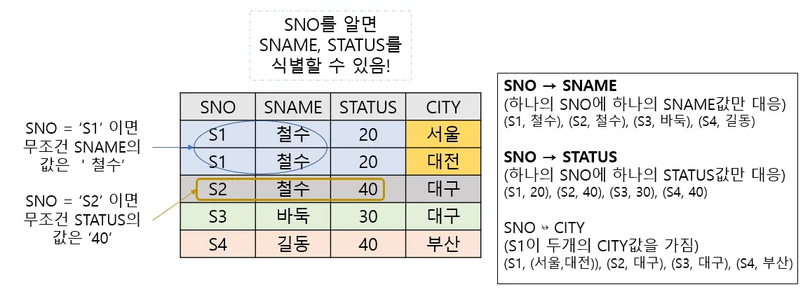

### ◼ 결정자와 종속자

> B가 A의 함수 종속일때, A를 결정자, B를 종속자 라고 한다
> 

### ◼ 완전 함수적 종속

- **기본키**인 **A에만 B가 종속된 경우**
- **기본키가 여러개의 속성**일 경우 **기본키의 모든 속성에 종속된 경우**

### ◼ 부분 함수적 종속

- **기본키가 아닌 다른 속성에 종속**되는 경우
- **기본키가 여러개의 속성**일 때 **기본키의 일부 속성에만 종속된 경우**

### ◼ 이행적 함수 종속성

- **X → Y, Y → Z의 종속관계가 존재**할때  **X → Z의 종속관계**가 성립

### 정규화 과정

### 🔷 비정규형

- 다중치값 속성을 가지는 릴레이션

다중치값?

- 하나의 속성에 두개 이상의 값이 들어가있는 것
- 원자값과 대응되는 말

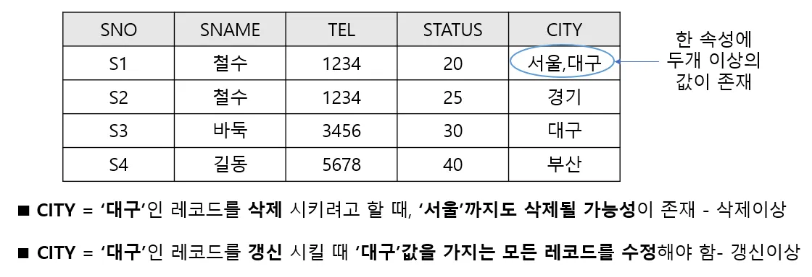

### 🔷 제 1 정규형(1NF)

- 릴레이션에 속한 모든 도메인이 **원자값으로만 구성**
- **비정규형에서 다중치값을 분해**

### ◼ 부분 함수적 종속성 제거

**기본키가 여러개**일때, **기본키의 모든 속성**을 **종속하지 않는 속성들을 분리**함

- 제 2 정규형을 만족하도록 만듦

- SNO에 종속된 속성들과 PNO에 종속된 속성들을 분리한다
⇒ 분리 후
    
    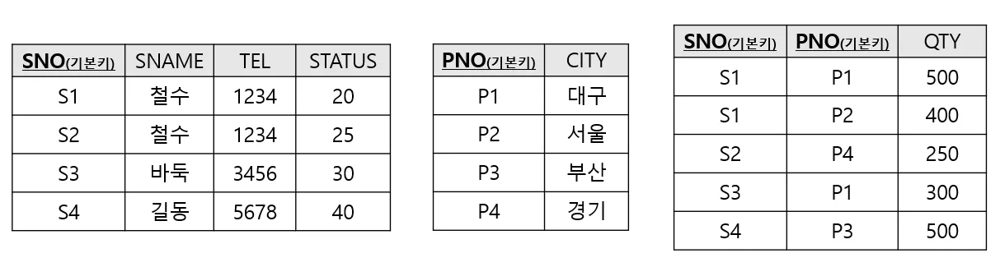
    

### 🔷 제 2 정규형(2NF)

**기본키에 속하지 않는 모든 속성**이 **완전 함수적 종속**인 릴레이션

- **제 1 정규형**에서 **부분 함수적 종속성을 제거**한 릴레이션
- **제 1 정규형**인 릴레이션의 **기본키가 단일 속성**이라면 **제 2 정규형도 만족**한다.

(부분 함수적 종속성은 기본키가 단일 속성이라면 존재하지 않음)

### ◼ 이행적 함수 종속성 제거

- **X → Y이고 Y → Z인 종속관계가 존재**한다면 분리한다
- **제 3 정규형을 만족**하도록 만듦

- SNO → SNAME이고 SNAME → TEL이므로, 분리한다
    
    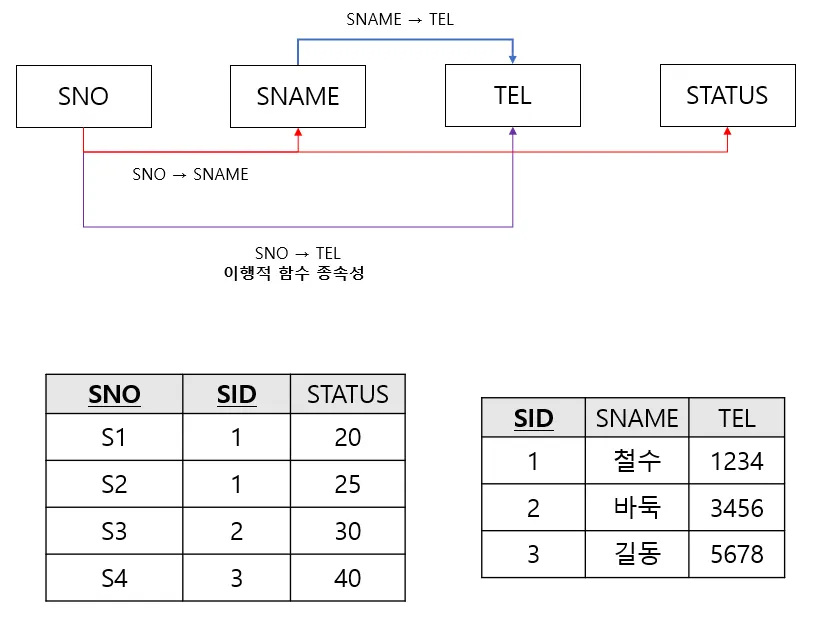
    

### 🔷 제 3 정규형(3NF)

**제 2 정규형을 만족**하면서 **이행적 함수 종속성이 없는** 릴레이션

### 🔷 BCNF

- 보이스와 코드가 제안한 정규화 개념
- **강한 제 3 정규형** 이라고도 함
- **모든 결정자**가 **후보키**인 경우

---

## 📗 진보된 정규형

### 🔷 제 4 정규형

> 제 3 정규형을 만족하면서 다중치 종속성이 존재하지 않는 릴레이션
> 

### ◼ 다중치 종속성

- **속성 A가 속성 B의 다중치 값을 결정**하는 것 **A ↠ B**로 표기
- **'속성 B가 속성 A에 다중치 종속 되었다'** 라고 함
- 한 번만 삽입될 레코드가 여러 행에 걸쳐 중복되어 저장되는 문제
- 제 1 정규형의 원자값만을 가져야하는 제약조건이 원인
    
    ![다중치 종속성.PNG]!(다중치종속성.png)
    

- **단순 다중치 종속성**
    - A ↠ B 일때, B가 A의 부분집합인 경우 또는 A, B가 전체 릴레이션인 경우

- **비단순 다중치 종속성**
    - 단순 다중치 종속성이 아닌 모든 경우
    - 모든 속성이 기본키인 경우가 일반적
    

### 🔷 제 5 정규형

- 제 4 정규형을 만족하면서 모든 조인 종속이 릴레이션의 후보키를 통해서만 성립

### ◼ 조인 종속

- **테이블을 분해**한 후 **다시 조인**하였을 때, **원래의 테이블과 동일**하게 **복원되는 것**

### 정리

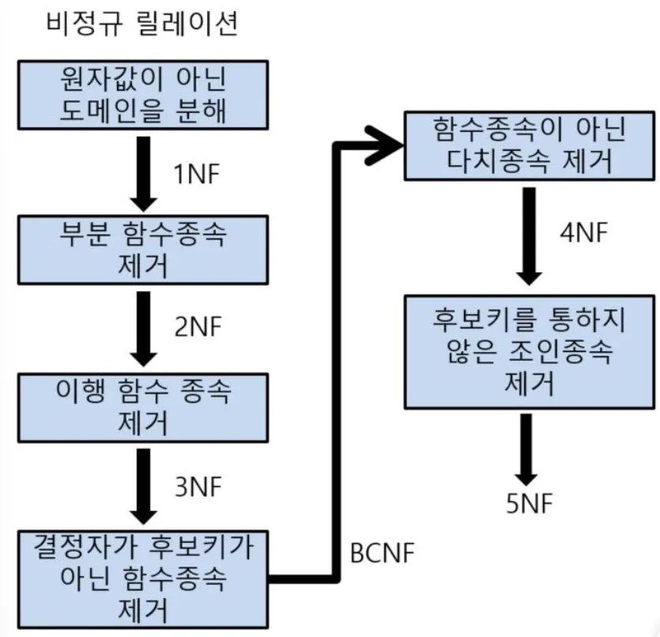

### 반정규화?!

- 정규화를 위해서 외래키를 사용하는 경우가 종종 있다.
- 하지만 실무에서는 외래키를 잘 사용하지 않는다고 한다…(1학기 스터디내용)

[MySQL - 외래키(Foreign Key)를 써야할까?](https://yeoon.tistory.com/165)

[실무에서 외래키를 사용하지 않는 이유가 궁금합니다. - Inflearn | Community Q&A](https://www.inflearn.com/community/questions/629396/%EC%8B%A4%EB%AC%B4%EC%97%90%EC%84%9C-%EC%99%B8%EB%9E%98%ED%82%A4%EB%A5%BC-%EC%82%AC%EC%9A%A9%ED%95%98%EC%A7%80-%EC%95%8A%EB%8A%94-%EC%9D%B4%EC%9C%A0%EA%B0%80-%EA%B6%81%EA%B8%88%ED%95%A9%EB%8B%88%EB%8B%A4)

---

### 참고 문헌

[트랜잭션(Transaction)이란](https://doooyeon.github.io/2018/09/28/transaction.html)

[[데이터베이스] 트랜잭션 격리 수준(Isolation level)](https://velog.io/@yujiniii/%EB%8D%B0%EC%9D%B4%ED%84%B0%EB%B2%A0%EC%9D%B4%EC%8A%A4-%ED%8A%B8%EB%9E%9C%EC%9E%AD%EC%85%98-%EA%B2%A9%EB%A6%AC-%EC%88%98%EC%A4%80)

[[DB] 트랜잭션 격리수준 (Isolation Level) 에 쉽게 이해하기](https://tlatmsrud.tistory.com/118)