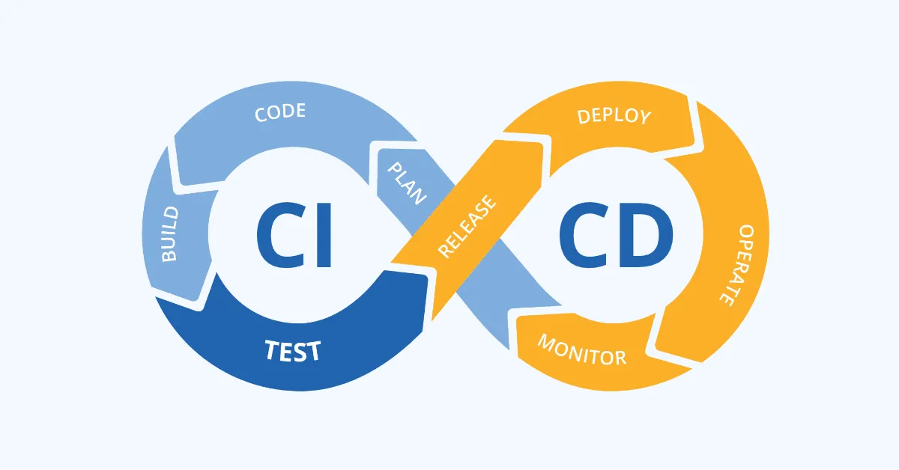
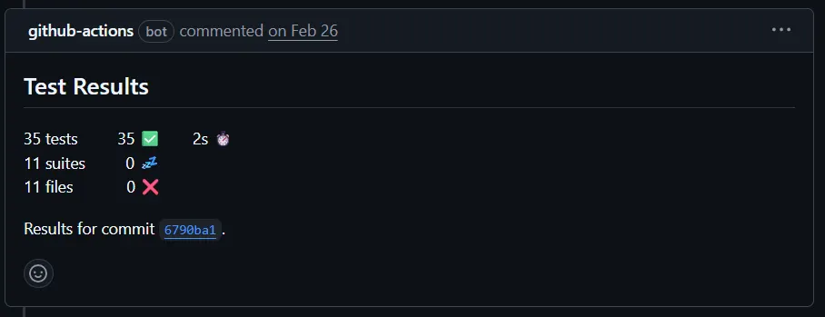

# CI/CD



### CI/CD를 하는 이유?

자동으로 테스트와 배포까지 진행해주어, 개발 라이프사이클을 간소화하고 가속화시켜줌

# CI(Continuous Integration)

- 지속적 통합이라고 함
- 공유 저장소에 merge를 하면 자동화된 빌드, 테스트가 실행되어서 해당 코드가 오류가 없는지 확인 할 수 있음

- A 개발자가 코드를 고쳤을 때, B 개발자가 만든 기능에 문제가 생기는 경우를 빠르게 찾아낼 수 있음.

# CD(Continuous Delivery/Deployment)

- 지속적 배포라고 함
- CI이후 코드가 자동으로 배포될 수 있도록 하는 프로세스
- 테스트가 완료된 코드를 바로 배포할 수 있어 새로운 기능을 더욱 빠르게 제공할 수 있음

## CI/CD 파이프라인


CI와 CD를 하나의 파이프라인으로 설계하여, 코드를 공유저장소에 올리면 바로 테스트와 배포까지 진행되도록 함.

- **빌드 단계**: 소스 코드를 컴파일하고, 필요한 라이브러리를 다운로드하며, 애플리케이션을 패키징 합니다.
- **테스트 단계**: 유닛 테스트, 통합 테스트, 기능 테스트 등을 실행하여 코드의 품질을 검증합니다.
- **배포 단계**: 테스트가 통과된 코드를 스테이징 환경이나 프로덕션 환경에 배포합니다. 여기에는 Docker 이미지 생성 및 배포, Kubernetes 클러스터에 배포 등이 포함될 수 있습니다.
- **모니터링 및 피드백 단계**: 배포된 애플리케이션의 성능과 안정성을 모니터링하고, 로그 및 사용자 피드백을 수집합니다. 이를 통해 발생한 문제를 빠르게 해결할 수 있습니다.

## GithubAction으로 CI/CD 설계하기

실제로 사용했던 yml코드

```yaml
name: Java CI with Gradle

on:
  pull_request:
    branches: [ "develop" ]

jobs:
  ci:
    runs-on: ubuntu-latest
    permissions: write-all

    steps:
    - uses: actions/checkout@v4

    - name: Set up JDK 21
      uses: actions/setup-java@v4
      with:
        java-version: '21'
        distribution: 'adopt'
        cache: gradle 

    - name: Grant execute permission for gradlew
      run: chmod +x gradlew

    - name: Install dependencies
      run: ./gradlew dependencies

    - name: Run tests
      env:
        SPRING_PROFILES_ACTIVE: "test"
        DATABASE_URL: "jdbc:h2:mem:testdb;DB_CLOSE_DELAY=-1"
        DB_USERNAME: "DB_NAME"
        DB_PASSWORD: "DB_PASSWORD"
      run: ./gradlew clean build

    - name: Upload build artifact
      uses: actions/upload-artifact@v4
      with:
        name: Project
        path: build/libs/*.jar

    - name: 테스트 결과를 PR에 코멘트로 등록하기
      uses: EnricoMi/publish-unit-test-result-action@v2
      if: always()
      with:
        files: '**/build/test-results/test/TEST-*.xml'

  cd:
    runs-on: ubuntu-latest
    needs: ci

    steps:
      - uses: actions/checkout@v4

      - name: Download build artifact
        uses: actions/download-artifact@v4
        with:
          name: Project
          path: ./build/libs

      # Docker Hub login
      - name: Login to Docker Hub
        run: |
          echo "${{ secrets.DOCKER_PASSWORD }}" | docker login -u "${{ secrets.DOCKER_USERNAME }}" --password-stdin

      # Build and Push Docker Image
      - name: Build and Push Docker Image
        run: |
          docker build -t ${{ secrets.DOCKER_USERNAME }}/devlog:latest .
          docker push ${{ secrets.DOCKER_USERNAME }}/devlog:latest

      - name: Create .ssh directory and add EC2 host key
        run: |
          mkdir -p ~/.ssh
          ssh-keyscan -H ${{ secrets.EC2_HOST }} >> ~/.ssh/known_hosts

      - name: Create private key file
        run: |
          echo "${{ secrets.SSH_PRIVATE_KEY }}" > private_key.pem
          chmod 600 private_key.pem

      - name: Upload project files to EC2
        run: |
          rsync -avz --progress --checksum --exclude 'node_modules' --exclude '.git' \
          -e "ssh -i private_key.pem" ./ \
          ${{ secrets.EC2_USER }}@${{ secrets.EC2_HOST }}:/home/${{ secrets.EC2_USER }}/project/

      - name: Deploy to EC2 and restart Docker containers using Docker Compose
        uses: appleboy/ssh-action@master
        with:
          host: ${{ secrets.EC2_HOST }}
          username: ${{ secrets.EC2_USER }}
          key: ${{ secrets.SSH_PRIVATE_KEY }}
          script: |
            cd /home/${{ secrets.EC2_USER }}/project/

            # 환경 변수 파일 생성
            echo "MYSQL_ROOT_PASSWORD=${{ secrets.MYSQL_ROOT_PASSWORD }}" > .env
            echo "MYSQL_PASSWORD=${{ secrets.MYSQL_PASSWORD }}" >> .env
            echo "DOCKER_USERNAME=${{ secrets.DOCKER_USERNAME }}" >> .env

            # Stop and remove existing containers
            docker-compose down || true

            # Pull the latest Docker image
            #docker-compose pull

            # Start the containers using Docker Compose
            docker-compose up -d --build

      #- name: Add EC2 public IP to /etc/hosts
      #  run: |
      #    echo "$EC2_PUBLIC_IP backend" | sudo tee -a /etc/hosts
      #  env:
      #    EC2_PUBLIC_IP: ${{ secrets.EC2_HOST }}

      #- name: Wait for init server
      #  run: sleep 650

      #- name: Test HTTP response
      #  run: |
      #    curl -v http://myDomain

      - name: Remove private key file
        run: rm -f private_key.pem
```

### 실행 과정 설명

시작 조건 : ‘develop’라는 브랜치에 PR날리기

### CI 과정

1. ubuntu 가상머신 실행
2. checkout으로 코드를 가져옴
3. JDK 21과 Gradle, 의존성 설치
    1. 이때, cache를 통해 관련파일들을 저장해둠
        1. 빌드속도 향상을 위함.
        2. 앵간한 경우에는 모두 사용하면 좋음
4. 테스트 및 빌드 실행
5. 빌드 결과를 Artifact로 업로드 (jar파일 생성)
6. 테스트 결과 리포트(PR 댓글에 자동으로 달리게됨)



### CD 과정

1. CI 과정에서 만든 빌드 결과(jar)와 Dockerfile,docker-compose.yml을 받음
2. Docker hub에 로그인하여 이미지 생성 및 업로드
3. EC2의 pem키 파일을 만듬 (pem파일을 생성한 후, github secrets에 해당 정보를 저장해두면 안전하게 사용가능)
4. pem키 파일을 통해 SSH로 EC2에 접속
5. 프로젝트 파일 이동
6. docker-compose를 통해 새로 배포된 코드를 기반으로 다시 서버 가동
7. 위에서 만든 pem 키 삭제 - 보안을 위해서

- 위 과정의 단점
    - 항상 docker-compose down으로 서버가 한번 꺼지는 순간이 생김

⇒ 무중단 배포로 해결 가능

- 간단히 말하면, .0서버를 두 개 이상 켜두고, 사용자를 받지 않는 서버에서 업데이트를 진행.
- 그 후, 업데이트된 서버와 기존 서버를 라우팅을 교체하여 바꿔치기 하는 방식

[[Infra] 무중단 배포 방식(Rolling / BlueGreen / Canary)](https://llshl.tistory.com/47)

---

### 참고 문헌

[CI/CD란 무엇인가 (Feat. DevOps 엔지니어)](https://artist-developer.tistory.com/24)

[CI/CD: 지속적 통합과 배포의 핵심 개념과 차이점 이해하기](https://www.redhat.com/ko/topics/devops/what-is-ci-cd)