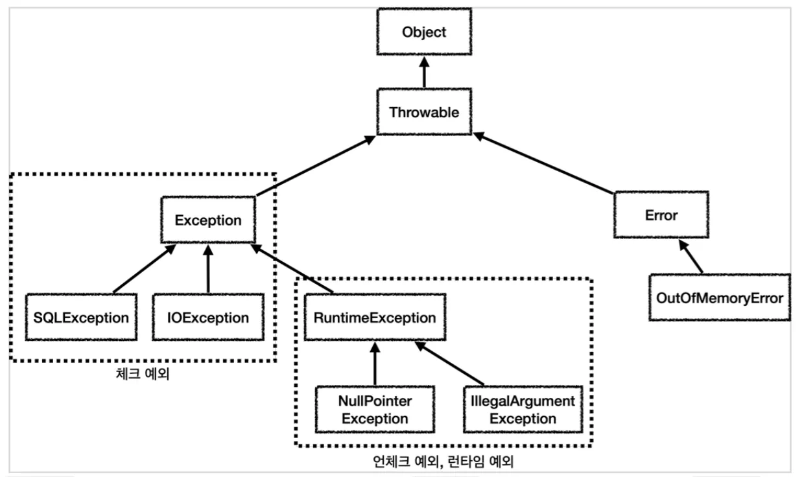
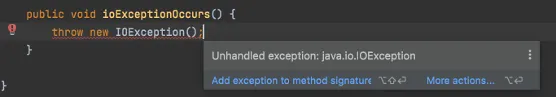
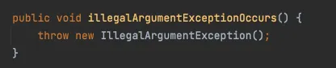
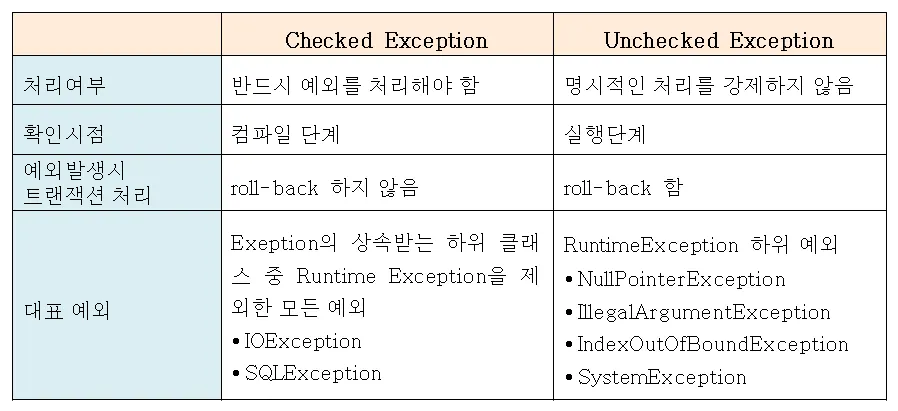
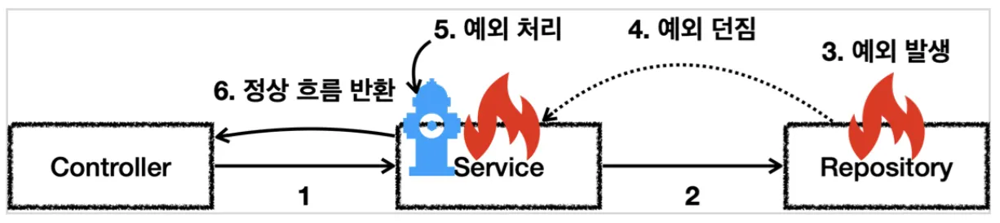
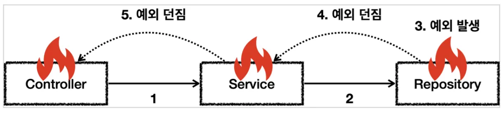
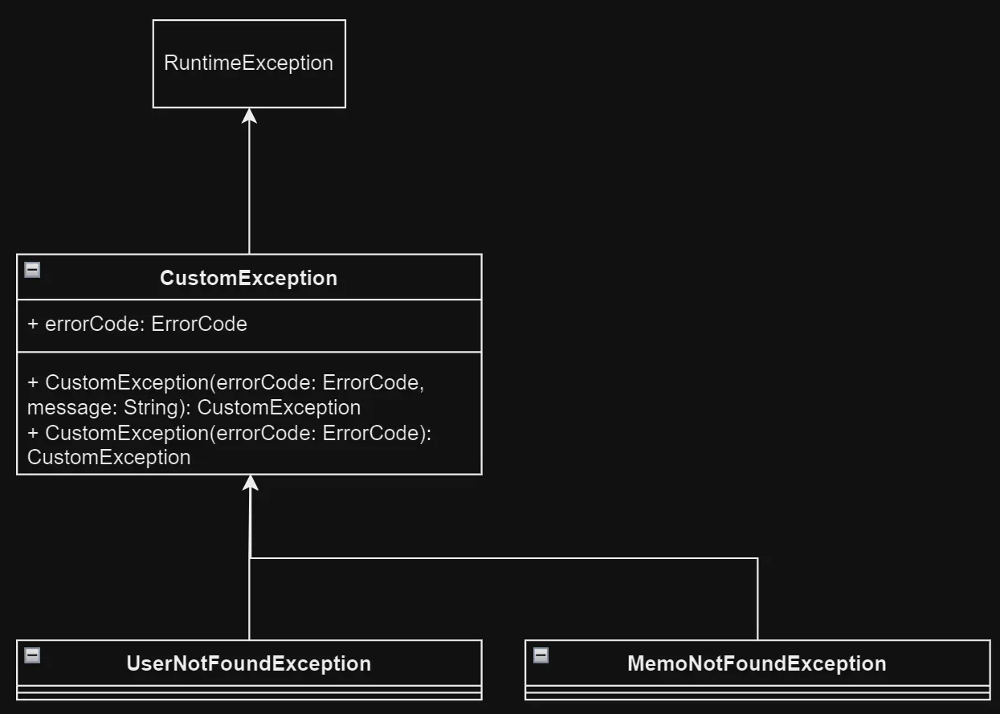

## JAVA의 예외 처리

### 예외란?

개발자의 실수로 프로그램 실행 중 원하지 않은 상황이 발생한 경우

## Checked, Unchecked 예외

예외 객체



예외또한 객체로써 다루기 때문에, Object가 최상위 객체이다.

### Checked Exception

개발자가 try-catch 로 잡아서 후처리를 해야하는 예외들을 말한다.

컴파일 단계에서 체크하기 때문에 Checked Exception 이라고 한다.

인텔리제이가 예외처리 하라고 시키는 예외들



- **Exception 객체**

애플리케이션 로직에서 다룰 수 있는 최상위 예외. 

단, RuntimeException은 Unchecked Exception이다.

또한, SQLException은 Spring에서 언체크예외로 전환시켜놓았음. 그래서 예외처리를 따로 하지 않아도, SQL문이 잘못되었다는 에러로그가 뜨며 롤백되는 것!

### Unchecked Exception

개발자가 예외처리를 따로 하지 않아도 된다. (try-catch 문으로 후처리를 안해도됨)

컴파일 시간에 예외 처리를 확인하지 않아서 Unchecked Exception 이라고 한다.



- **Error**

메모리 부족, 심각한 시스템 오류와 같이 복구가 불가능한 시스템 예외.

Unchecked Exception에 속함

- **RuntimeException**

NullPointerException, IllegalArgumentException과 같이 실행 중에 예상치 못하게 발생하는 예외.

Error와 마찬가지로 해당상황에서 복구가 불가능함.

### Spring에서 Unchecked는 예외처리를 하지않아도 되는 이유?

- 자동으로 외부로 예외를 던짐.
    - 외부란 요청을 보낸 클라이언트를 말함.
    - ex) Postman, 브라우저, 애플리케이션
    
- @Transactional 어노테이션을 사용한 경우
    - Unchecked 예외가 터지면, 트랜잭션 롤백이 됨.
    - Checked는 롤백이 안됨!

### 정리



## 예외 처리 방법



예외를 처리하지 않는다면?



예외는 계속해서 함수의 호출부를 따라서 올라감. ~~흐르는 강물을 거슬러 올라가는 연어~~

그래서 결국 main 함수까지 올라가면 시스템이 종료되어버리는 치명적인 사태가 발생할 수 있음. 

이를 막기 위해 컴파일 시간에 체크하거나 자체적으로 외부로 던져버리는 형태로 처리하는 것

### 예외 복구

- 예외가 왜 발생했는지를 알고 해당 문제를 해결하여 복구하는 것
- 예를들어, 통신 실패 시, 여러번 다시 연결을 시도하여 예외 복구를 시도하는 것

### 예외 처리 회피

- 예외 처리를 자신이 아닌, 자신을 호출한 곳으로 던져버리는 것
- 이 예외를 이 메소드가 처리할 책임이 없다면, 자신을 호출한 메소드로 던져버림.
- ex) 상품 구매 로직에서 재고 부족 예외가 발생
    - 이때, Service 객체가 아닌 Controller 혹은 아래에서 볼 Handler객체가 예외를 처리하는 경우
- ex) 알바하다가 강도가 들어서 비상벨을 누르는 행위

### 예외 전환

- 예외를 복구할 수 없는 상황에 사용
- 예외가 적절한 의미를 가지지 않는다면, 이를 부여하는 것
- ex) 커스텀 예외

## 올바른 예외 처리 방법

### 그냥 try-catch로 감싸두기만 하지 않기

- 무시하고 다음 줄 실행과 같은 의도가 아니라면 무조건 처리하기

### 무분별하게 throws Exception 사용 금지

```java
public void method1() throws Exception {
    method2();
}

public void method2() throws Exception {
    method3();
}

public void method3() throws Exception {

}
```

- 위와 같이 예외를 처리하면 모든 예외를 받아버림.
- 처리해야할 체크예외까지도 받아버려 문제가 생길 수 있음
- 의미있는 정보를 코드 상으로 얻을 수 없어 예외 발생 시, 수정이 힘들 수 있음

---

## 예외 커스텀하기

Java에서는 예외도 객체로 다루기 때문에, 예외 객체를 상속하는 객체를 만들어서 커스텀 예외를 생성할 수 있음!

- 대부분의 경우, RuntimeException을 상속받아서 커스텀 예외 생성
- 비즈니스 예외 클래스가 이미 있다면, 그걸 상속하는 경우도 있



이런 방식으로 예외 객체를 상속받는 커스텀 예외 객체를 생성할 수 있음

```java
@Getter
public class CustomException extends RuntimeException {
    protected ErrorCode errorCode;

    public CustomException(ErrorCode errorCode) {
        this.errorCode = errorCode;
    }

    public CustomException(ErrorCode errorCode, String message) {
        super(message);
        this.errorCode = errorCode;
    }
}
public class UserNotFoundException extends CustomException {
    public UserNotFoundException (ErrorCode errorCode) {
        super(errorCode);
    }
}
public class MemoNotFoundException extends CustomException {
    public MemoNotFoundException (ErrorCode errorCode, String detail) {
        super(errorCode, detail);
    }
}
```

```java
@Getter
@AllArgsConstructor
public enum ErrorCode {
    // 인증 관련
    USER_NOT_AUTHENTICATED(HttpStatus.UNAUTHORIZED, "E001", "로그인이 필요합니다.");
}
```

```java
@Getter
@NoArgsConstructor(access = AccessLevel.PROTECTED) // 기본 생성자를 protected로 생성
public class ErrorResponse {

    private HttpStatus status;      // HTTP 상태 코드 (예: 400, 404)
    private String code;     // 에러 코드 문자열 (예: "INVALID_INPUT")
    private String message;  // 에러 메시지
    private List<FieldError> errors; // 필드 오류 리스트

    // 에러 코드 + 필드 에러 목록을 담은 생성자
    private ErrorResponse(final ErrorCode code, final List<FieldError> errors) {
        this.status = code.getStatus();
        this.code = code.getCode();
        this.message = code.getMessage();
        this.errors = errors;
    }

    // 에러 코드만 담는 생성자 (필드 에러가 없는 경우)
    private ErrorResponse(final ErrorCode code) {
        this.status = code.getStatus();
        this.code = code.getCode();
        this.message = code.getMessage();
        this.errors = new ArrayList<>(); // 빈 리스트로 초기화
    }

    // BindingResult 기반 오류 생성 (form validation 실패 등)
    public static ErrorResponse of(final ErrorCode code, final BindingResult bindingResult) {
        return new ErrorResponse(code, FieldError.of(bindingResult));
    }

    // ConstraintViolation 기반 오류 생성 (DTO에 @Valid 사용 시 발생)
    public static ErrorResponse of(final ErrorCode code, final Set<ConstraintViolation<?>> constraintViolations) {
        return new ErrorResponse(code, FieldError.of(constraintViolations));
    }

    // 누락된 파라미터 처리용 오류 응답 생성
    public static ErrorResponse of(final ErrorCode code, final String missingParameterName) {
        return new ErrorResponse(code, FieldError.of(missingParameterName, "", "parameter must required"));
    }

    // 단순 에러 코드만 있을 때 사용
    public static ErrorResponse of(final ErrorCode code) {
        return new ErrorResponse(code);
    }

    // 외부에서 직접 FieldError 리스트를 주입할 때 사용
    public static ErrorResponse of(final ErrorCode code, final List<FieldError> errors) {
        return new ErrorResponse(code, errors);
    }

    // 파라미터 타입 불일치 예외 처리용 응답 생성
    public static ErrorResponse of(MethodArgumentTypeMismatchException e) {
        final String value = e.getValue() == null ? "" : e.getValue().toString();
        final List<FieldError> errors = FieldError.of(e.getName(), value, e.getErrorCode());
        return new ErrorResponse(ErrorCode.INVALID_TYPE_VALUE, errors);
    }

    // 내부 클래스: 필드 단위 에러 정보 표현
    @Getter
    @NoArgsConstructor(access = AccessLevel.PROTECTED)
    public static class FieldError {
        private String field;   // 오류가 발생한 필드명
        private String value;   // 잘못된 값
        private String reason;  // 오류 사유

        public FieldError(String field, String value, String reason) {
            this.field = field;
            this.value = value;
            this.reason = reason;
        }

        // 단일 필드 오류로 리스트 생성
        public static List<FieldError> of(final String field, final String value, final String reason) {
            List<FieldError> fieldErrors = new ArrayList<>();
            fieldErrors.add(new FieldError(field, value, reason));
            return fieldErrors;
        }

        // BindingResult → FieldError 변환
        public static List<FieldError> of(final BindingResult bindingResult) {
            final List<org.springframework.validation.FieldError> fieldErrors = bindingResult.getFieldErrors();
            return fieldErrors.stream()
                    .map(error -> new FieldError(
                            error.getField(),
                            error.getRejectedValue() == null ? "" : error.getRejectedValue().toString(),
                            error.getDefaultMessage()
                    ))
                    .collect(Collectors.toList());
        }

        // ConstraintViolation → FieldError 변환
        public static List<FieldError> of(final Set<ConstraintViolation<?>> constraintViolations) {
            List<ConstraintViolation<?>> lists = new ArrayList<>(constraintViolations);
            return lists.stream()
                    .map(error -> new FieldError(
                            error.getPropertyPath().toString(), // 필드 경로
                            "",
                            error.getMessageTemplate() // 메시지 템플릿 사용
                    ))
                    .collect(Collectors.toList());
        }
    }
}
```

```java
@Getter
public class UserNotAuthenticatedException extends RuntimeException {
    private final ErrorCode errorCode;

    public UserNotAuthenticatedException() {
        super(ErrorCode.USER_NOT_AUTHENTICATED.getMessage());
        this.errorCode = ErrorCode.USER_NOT_AUTHENTICATED;
    }
}
```

```java
@PutMapping("/logout")
public ResponseEntity<ApiResponse<String>> Logout(@AuthenticationPrincipal Account account) {
    if (account == null) throw new UserNotAuthenticatedException();
}
```

### Global Exception handler

### @RestControllerAdvice, @ControllerAdvice

- 두 어노테이션의 차이는 @ResponseBody의 여부 (RestController와 Controller의 차이)

**장점**

- Controller에서 예외처리를 하지 않아도 된다.
    - 예외 발생 시, 해당 어노테이션이 선언된 클래스에서 예외를 캐치하고 처리함
- 예외에 따라 다른 처리 로직 적용가능
    - @ExceptionHandler를 사용하여 특정 예외에 대한 Handler 메소드를 정의할 수 있다.
- 예외 처리 로직을 재사용할 수 있다.
    - 같은 예외가 선언된 모든 곳에서 같은 방식으로 예외 처리가 가능함.

- 위에서 만든 커스텀 예외를 처리하는 핸들러

```java
@Slf4j
@RestControllerAdvice
public class GlobalExceptionHandler {
	  @ExceptionHandler
    protected ResponseEntity<ErrorResponse> handleUserNotAuthenticatedException(UserNotAuthenticatedException e) {
        final ErrorResponse response = ErrorResponse.of(USER_NOT_AUTHENTICATED, e.getMessage());
        return new ResponseEntity<>(response, response.getStatus());
    }
}
```

- 커스텀 예외 처리를 위해 @RestControllerAdvice 사용
- @ExceptionHandler 를 사용하여 해당 메소드가 커스텀 예외를 처리하도록 함.

---

### 참고 문헌

[Spring Boot에선 예외를 어떻게 처리할까?(전역, 커스텀 예외처리)](https://dev-allday.tistory.com/77)

[[Java] 체크 예외(Check Exception)와 언체크 예외/런타임 예외 (Uncheck Exception, Runtime Exception)의 차이와 올바른 예외 처리 방법](https://mangkyu.tistory.com/152)

[[Java] 체크 예외 vs 언체크 예외](https://velog.io/@dondonee/Java-%EC%B2%B4%ED%81%AC-%EC%98%88%EC%99%B8-vs-%EC%96%B8%EC%B2%B4%ED%81%AC-%EC%98%88%EC%99%B8)

[[Java] Checked Exception vs Unchecked Exception 정리](https://devlog-wjdrbs96.tistory.com/351)