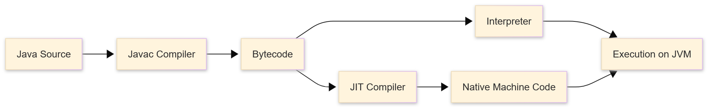
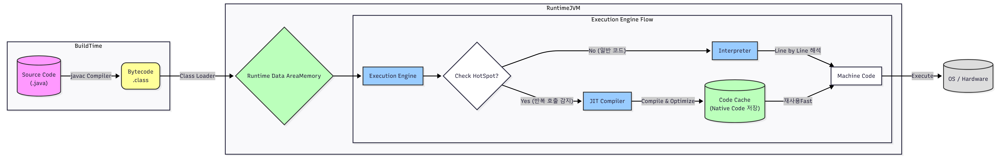
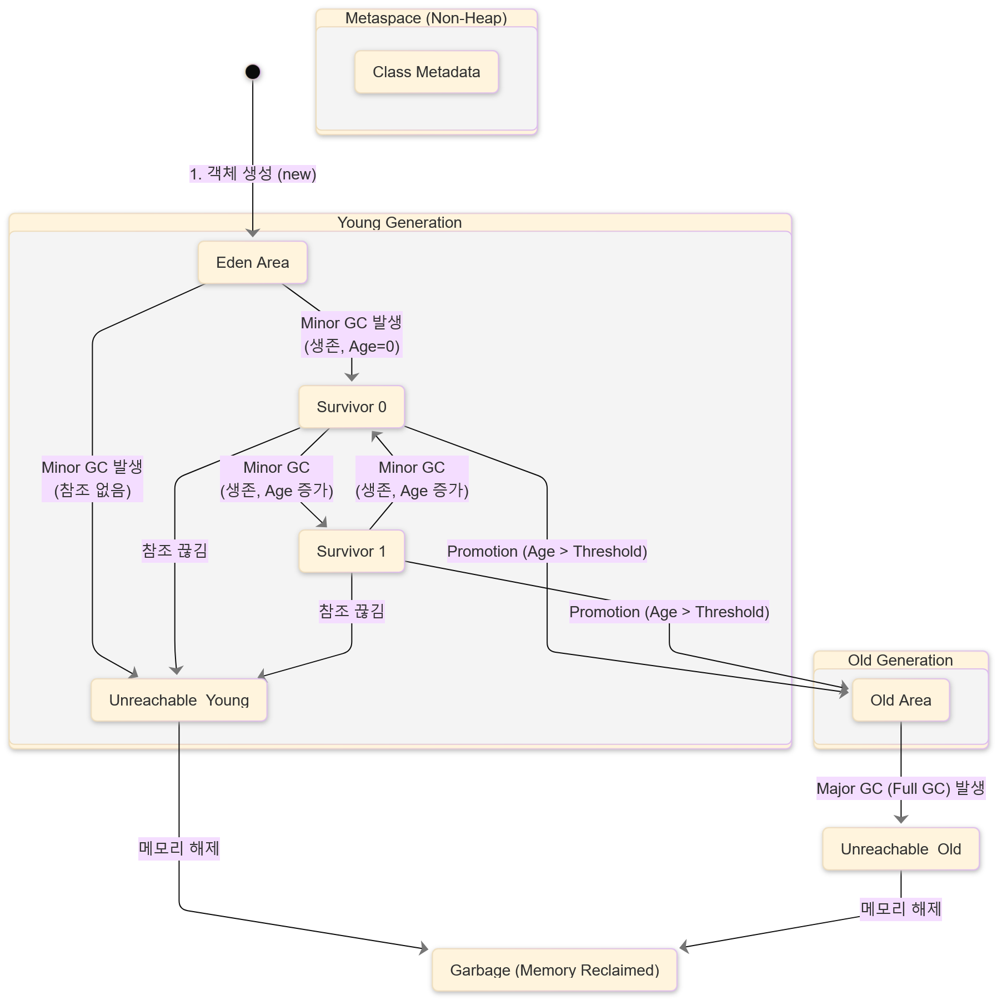

# Java 컴파일 과정과 JVM의 메모리 관리(GC, Caching)

## Java는 컴파일 언어인가요? 인터프리터 언어인가요?

> 자바는 하이브리드 방식을 사용합니다.

> 요약본

- Java Source (.java)

- Bytecode (.class)
    - JVM이 실행할 수 있는 중간 코드 (플랫폼 독립적)
    - 흔히 빌드 결과로 알려진 .jar파일은 .class 파일과 리소스, 메타 정보 등을 하나의 JAR 파일로 묶은 형태입니다.
        - 이를 배포하면 플랫폼 상관없이 바로 실행할 수 있습니다.
- machine code (기계어)
    - 실제로 기계가 이해하고 동작시키는 코드 (플랫폼 의존적)

> 전체 구조

## 가비지 컬렉션 (Garbage Collection, GC) 동작 과정

> 자바에서는 사용하지 않는 메모리를 가비지 컬렉터가 자동으로 회수합니다. 어떻게 구현되어 있을까요?

1. 대부분의 객체는 금방 접근 불가능 상태가 된다.
2. 오래된 객체에서 새로 생긴 객체로의 참조는 아주 가끔 일어난다.

### GC 과정

#### Young Generation 
- Eden
    - new 키워드를 통해 객체가 처음 만들어지는 공간
- Survisor 0 / 1
    - Eden 영역이 꽉 찬 경우(minor GC) 살아남은 객체들을 이동시키는 공간
        - 사용적인 객체는 Survivor로, 나머지는 삭제
        - Survivor에서 오래 살아남은 객체들은 Old 영역으로 이동합니다.

#### Old Generation
> Young 영역에서 오래 살아남은 객체들이 저장되는 공간

- Young영역보다 크기가 크고, GC가 적게 발생한다.
- 만약 Old Generation이 가득 차면 GC를 수행하는 쓰레드를 제외한 모든 애플리케이션 쓰레드가 멈춘다. (STW - Stop-The-World)

> 추가 : GC가 사용되지 않는 객체를 찾아내는 구체적인 알고리즘을 더 공부하셔서 평상시에 알아두신다면 매우매우 유용하게 사용할 곳이 많을 것 같습니다. (면접 때 여기까지 답할 수 있다면 분위기가 매우 좋아질 것 같습니다)