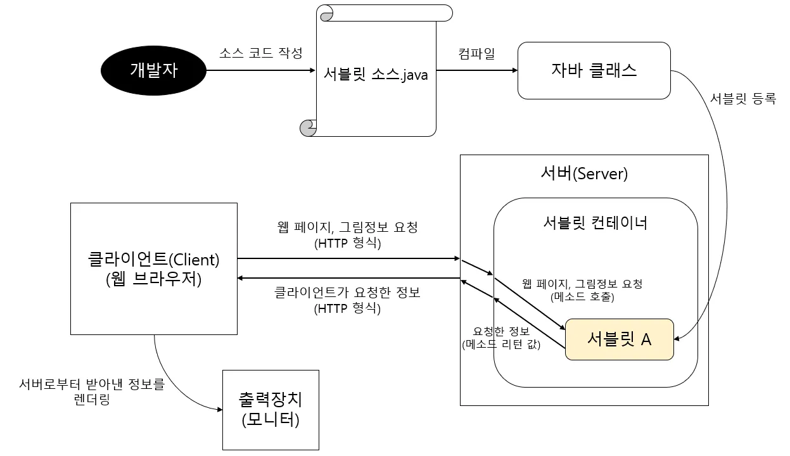
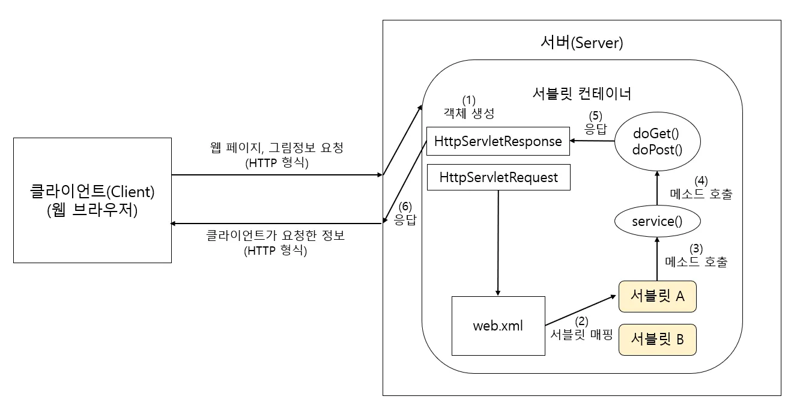
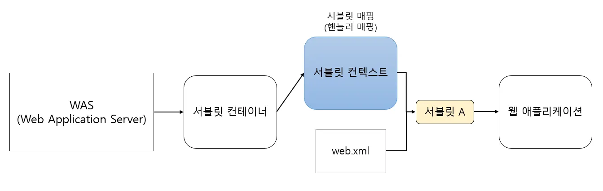
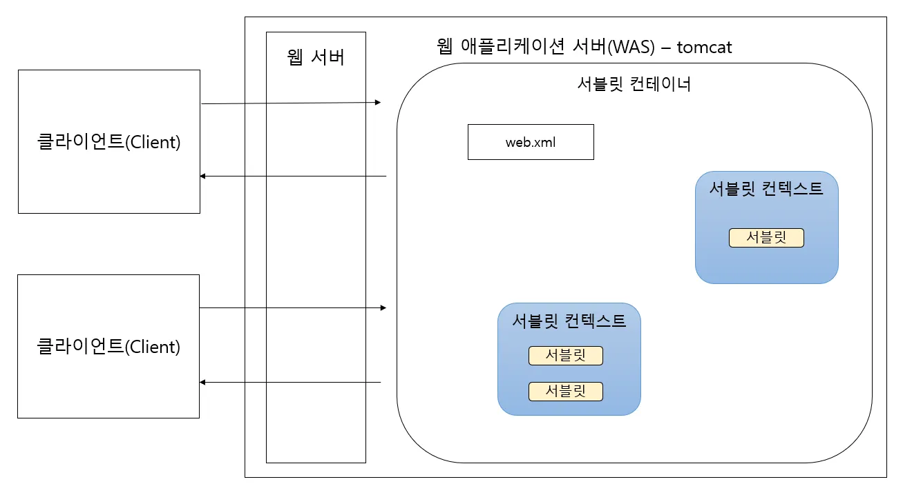
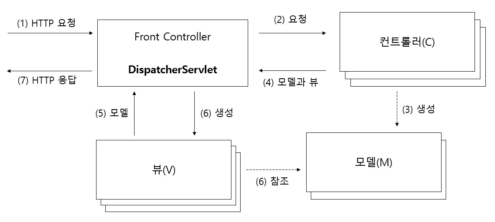
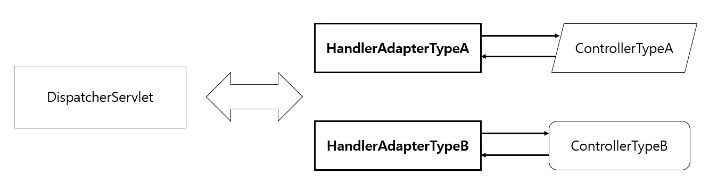
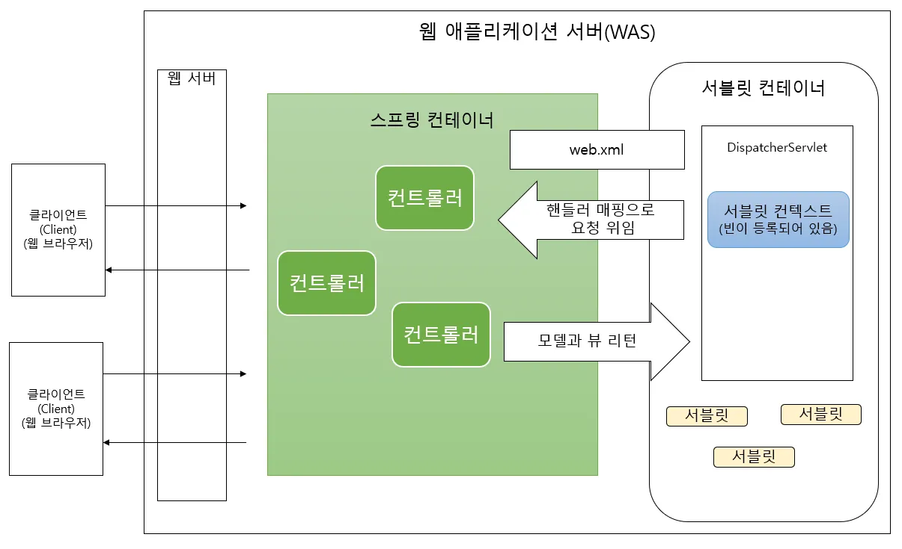

# Servlet과 Servlet Context 그리고 Spring

### 서블릿의 정의

서블릿이 무엇인지 한 줄로 정의하자면 다음과 같습니다.

> "서블릿은 자바(Java)를 사용하여 웹페이지를 동적으로 생성하는 서버 측 프로그램이다."
> 

### 서블릿을 사용하는 이유

조금 더 자세히 알아볼까요? 우리는 1주차에 HTTP 프로토콜의 구조와 웹 통신 방식에 대해 살펴보았습니다.

기본적인 HTTP 통신만으로는 **정적인 페이지(이미 완성된 HTML 파일)**밖에 보여줄 수 없다는 한계가 있습니다. 하지만 현대의 웹사이트는 사용자마다 다른 정보를 보여주거나(로그인), 실시간 데이터를 처리하는 등 **동적인(Dynamic) 역할**을 수행해야 합니다.

과거에는 이를 처리하기 위해 CGI(Common Gateway Interface) 기술을 사용했으나, 요청이 올 때마다 새로운 프로세스를 생성해야 해서 서버 부하가 심했습니다. 반면, **서블릿은 스레드(Thread)를 이용하여 동작**하기 때문에 훨씬 효율적이고 빠르게 요청을 처리할 수 있습니다.

정리하자면, 서블릿은 다음과 같이 요약할 수 있습니다.

- **동적 웹 페이지(Dynamic Web Page)**를 만들 때 사용되는 자바 기반의 웹 기술
- 웹 요청과 응답의 흐름을 **메소드 호출만으로 체계적으로 다룰 수 있게 해주는 기술**
- 기존 CGI의 단점(속도, 메모리 효율)을 개선하여 자바로 구현한 기술

### 🔷 서블릿의 특징

서블릿은 다음과 같은 주요 특징을 가집니다.

1. **동적 처리:** 클라이언트의 Request에 대해 동적으로 작동하는 웹 애플리케이션 컴포넌트입니다.
2. **HTML 응답:** 자바 코드를 통해 HTML을 생성하여 Response 합니다.
3. **스레드 기반:** Java의 스레드(Thread)를 이용하여 동작하므로 다중 요청 처리에 효율적입니다.
4. **MVC 패턴:** MVC 패턴에서 **컨트롤러(Controller)** 역할을 수행합니다.
5. **상속:** HTTP 프로토콜 서비스를 지원하는 `javax.servlet.http.HttpServlet` 클래스를 상속받습니다.
6. **단점:** 자바 코드 안에 HTML을 작성해야 하므로, HTML 변경 시 서블릿을 **재컴파일(Re-compile)**해야 하는 번거로움이 있습니다. (이 단점을 해결하기 위해 JSP가 등장했습니다.)

### ⚙ 서블릿의 동작 원리

서블릿은 어떻게 동작할까요? 과정은 생각보다 간단합니다.

개발자가 서블릿을 자바 클래스로 작성하면, **웹 컨테이너(Web Container, 예: 톰캣)**가 이 서블릿을 관리하고 실행합니다.

1. 클라이언트의 요청이 들어오면 웹 컨테이너가 해당 서블릿을 찾습니다.
2. 서블릿의 메소드(service, doGet, doPost 등)를 호출하여 로직을 수행합니다.
3. 수행 결과를 HTML 등의 형태로 만들어 클라이언트에게 전송합니다.

### 🗂 서블릿 컨테이너란?

서블릿의 구체적인 동작 과정을 살펴보기 전에, 서블릿이 살고 있는 집인 **'서블릿 컨테이너'**에 대해 먼저 알아야 합니다.

1. 서블릿을 관리해주는 매니저

서블릿은 혼자서 작동하지 못합니다. 서블릿을 만들고(생성), 일을 시키고(호출), 퇴근시키는(소멸) 관리자가 필요한데, 이를 **서블릿 컨테이너**라고 부릅니다.

2. 컨테이너가 해주는 일

개발자인 우리가 `main()` 메소드를 안 짜도 서버가 돌아가는 이유는 컨테이너가 다 해주기 때문입니다.

1. **통신 지원:** 복잡한 네트워크 연결을 알아서 처리합니다.
2. **생명주기 관리:** 서블릿을 언제 만들고 언제 없앨지 관리합니다.
3. **멀티스레딩:** 손님이 100명이 와도 직원(스레드) 100명을 붙여서 동시에 처리해줍니다.

서블릿 컨테이너란 말 그대로 **서블릿을 담고 관리하는 상자!**

스프링을 사용해 보셨다면 '스프링 컨테이너'와 비슷한 개념으로 이해하시면 됩니다. 

우리가 흔히 사용하는 **톰캣(Tomcat)**이 바로 대표적인 오픈소스 서블릿 컨테이너입니다.

### 📝 서블릿 컨테이너의 주요 기능

서블릿 컨테이너는 단순히 서블릿을 보관만 하는 것이 아닙니다. 클라이언트의 요청이 들어오면 **`HttpServletRequest`**, **`HttpServletResponse`** 두 객체를 생성하여 서블릿이 원활하게 동작하도록 돕는 핵심적인 역할을 수행

1. **통신 지원 (Communication Support)**
    - 복잡한 네트워크 통신 과정을 대신 처리해줍니다. 웹 서버와 소켓을 만들고, 포트를 리스닝하고, 연결 요청이 들어오면 스트림을 생성하는 등의 과정을 개발자가 직접 구현할 필요가 없습니다.
    - 쉽게 말해, 개발자는 비즈니스 로직에만 집중하면 됩니다.
2. **생명주기 관리 (Lifecycle Management)**
    - 서블릿의 탄생부터 죽음까지 책임집니다.
    - 컨테이너가 초기화될 때 서블릿 클래스를 로딩 및 인스턴스화하고, 초기화 메소드(`init()`)를 호출합니다.
    - 요청이 들어오면 적절한 메소드(`service()`)를 찾아 실행하고, 서블릿의 역할이 끝나면 가비지 컬렉션(GC)을 통해 메모리에서 제거(`destroy()`)합니다.
3. **멀티스레딩 관리 (Multithreading Management)**
    - 서블릿 컨테이너는 요청이 올 때마다 스레드(Thread)를 할당하여 작업을 처리합니다.
    - 동시에 여러 요청이 들어와도 멀티스레딩 환경을 통해 동시다발적인 처리가 가능합니다.
    - **핵심:** 이미 메모리에 올라간 스레드를 재사용(스레드 풀)하거나 효율적으로 관리하기 때문에, 요청마다 프로세스를 새로 만드는 것보다 훨씬 빠르고 효율적입니다.
4. **선언적인 보안 관리 (Declarative Security)**
    - 보안과 관련된 기능을 컨테이너 차원에서 지원합니다. 따라서 개발자가 서블릿 코드 안에 일일이 보안 로직을 구현하지 않아도 됩니다.
    

### 🔗 서블릿의 세부적인 동작 흐름

이제 서블릿 컨테이너 안에서 서블릿이 실제로 어떻게 움직이는지 정리해 볼까요?

1. **객체 생성:** 클라이언트의 요청이 들어오면 컨테이너는 `HttpServletRequest`(요청 정보)와 `HttpServletResponse`(응답 정보) 객체를 생성합니다.
2. **서블릿 매핑:** `web.xml` 설정 파일(또는 `@WebServlet` 어노테이션)을 참고하여 어떤 서블릿이 이 요청을 처리할지 찾습니다.
3. **메소드 호출:** 찾은 서블릿의 `service()` 메소드를 호출합니다. 이 메소드는 요청 방식(Method)에 따라 `doGet()` 또는 `doPost()`를 호출합니다.
4. **동적 페이지 생성 및 응답:** 호출된 메소드는 비즈니스 로직을 수행하고 동적 페이지를 생성한 뒤, `HttpServletResponse` 객체에 담아 보냅니다.
5. **소멸:** 응답이 완료되면 사용된 `HttpServletRequest`, `HttpServletResponse` 객체는 소멸됩니다.

그림으로 정리해보면…

---

### 📄 JSP (Java Server Page)

서블릿을 공부하다 보면 항상 짝꿍처럼 따라오는 용어가 있습니다. 바로 **JSP**입니다. 서블릿과 JSP는 무슨 관계일까요?

### JSP란 무엇일까?

JSP는 다음과 같이 정의할 수 있습니다.

> **"정적인 HTML 코드 안에 JAVA 코드를 넣어서 동적으로 웹페이지를 구성할 수 있게 해주는 기술"**
> 

설명을 듣고 자바스크립트(JS)를 떠올리셨나요? 하지만 둘은 동작하는 위치가 다릅니다.

- **자바스크립트(JS):** 클라이언트(브라우저)에서 동작하는 스크립트 언어
- **JSP:** 서버에서 동작하는 웹 프로그래밍 기술

즉, JSP는 서버에서 코드가 실행된 뒤 **완성된 HTML만 클라이언트로 전달**됩니다.

### 🔷 JSP와 서블릿의 차이점

두 기술 모두 **'동적 페이지를 만들기 위한 기술'**이라는 목적은 같습니다.  하지만 **주객이 전도**되어 있다는 차이가 있습니다.

- **서블릿:** **Java 코드**가 주인이고, 그 안에 HTML이 손님으로 들어갑니다. (`HTML in Java`)
- **JSP:** **HTML 코드**가 주인이고, 그 안에 Java 코드가 손님으로 들어갑니다. (`Java in HTML`)

**💡 비교 분석:** 서블릿은 Java 코드로 작성되므로 복잡한 로직을 구현하기엔 좋지만, HTML을 문자열로 일일이 만들어야 해서 화면(UI)을 작성하거나 수정하기가 매우 까다롭습니다. 반면, JSP는 HTML 기반이라 화면 작성은 쉽지만, HTML 안에 자바 로직이 뒤섞이면 코드가 지저분해져(스파게티 코드) 유지보수가 어려워진다는 단점이 있습니다.

| **구분** | **장점** | **단점** | **형식** |
| --- | --- | --- | --- |
| **서블릿** | 복잡한 로직 구현에 적합 (Controller 역할) | 화면(HTML) 작성 및 수정이      매우 어려움 | **Java 코드 안에**
HTML 코드가 들어가는 방식  |
| **JSP** | 화면(HTML) 작성 및 수정이 용이함 (View 역할)  | 비즈니스 로직과 디자인이 섞여
유지보수가 어려움 (소스 노출 X) | **HTML 코드 안에**
Java 코드가 들어가는 방식  |

### 🗂 서블릿 컨텍스트란 무엇일까?

쉽게 말해 **"서블릿들이 공유하는 공용 작업 공간"**이자 **"컨테이너와 대화하는 창구"**입니다.

서블릿 컨텍스트는 다음과 같이 정의할 수 있습니다.

> **"서블릿 컨테이너와 서블릿이 통신하기 위해 사용되는 메소드를 지원하는 인터페이스"**
> 

앞서 서블릿 컨테이너가 `web.xml`을 통해 서블릿을 관리한다고 했었죠?
이때 `web.xml`에 작성된 정보(설정, 파라미터 등)를 시스템이 이해할 수 있는 형태로 가지고 있는 객체가 바로 **서블릿 컨텍스트**입니다. 즉, 서블릿 컨테이너는 이 컨텍스트를 통해 서블릿을 확인하고 실행합니다.

서블릿 컨텍스트가 어떤 일을 하는지 알았으니 앞서 배운 것과 연결하여 정리해봅시다.
서블릿 컨텍스트까지 포함된 클라이언트와 서버는 다음과 같이 그려볼 수 있을 것입니다.

그림을 보면서 지금까지 배웠던 내용을 연결시켜봅시다.

웹 브라우저에서 요청을 보내고 다시 응답을 받기까지, 서버 내부에서는 다음과 같은 일이 벌어집니다.

1. **요청 수신:** 웹 서버가 클라이언트(브라우저)의 요청을 받습니다.
2. **위임:** 웹 서버는 정적인 처리가 아닌 경우, **서블릿 컨테이너**에게 해당 요청을 위임합니다.
3. **객체 생성:** 요청을 받은 서블릿 컨테이너는 `HttpServletRequest`, `HttpServletResponse` 객체를 생성합니다. (요청 정보를 Request 객체에 담습니다.)
4. **서블릿 매핑:** 컨테이너는 **서블릿 컨텍스트**(`web.xml` 정보 등)를 참조하여, 이 요청을 어떤 서블릿이 처리해야 할지 판단(매핑)합니다.
5. **서블릿 호출:** 매핑된 서블릿에게 `HttpServletRequest`와 `HttpServletResponse`를 전달하며 실행을 요청합니다.
6. **서비스 실행:** 서블릿의 `service()` 메소드가 호출됩니다.
    - 요청 방식이 **GET**이면 `doGet()` 호출
    - 요청 방식이 **POST**이면 `doPost()` 호출
7. **응답 작성:** 서블릿은 비즈니스 로직을 수행하고, 그 결과를 `HttpServletResponse` 객체에 담습니다.
8. **전송:** 컨테이너는 `HttpServletResponse`에 담긴 정보를 HTTP 응답 형태로 변환하여 웹 서버를 통해 클라이언트에게 보냅니다.
9. **소멸:** 응답이 끝나면 사용된 `HttpServletRequest`, `HttpServletResponse` 객체는 **소멸(Garbage Collection)**됩니다.

- **서블릿은 죽지 않는다?**
    - 위 과정의 9번을 보면 Request/Response 객체는 사라지지만, **서블릿 객체(Servlet Instance)는 사라지지 않습니다.**
    - 서블릿은 한 번 만들어지면 메모리에 계속 상주하며 다음 요청을 기다립니다(Singleton). `destroy()`는 서버가 종료되거나 오랫동안 사용되지 않을 때만 호출됩니다.

### 잠깐, 톰캣(Tomcat)은 WAS인가요?

서블릿 편에서 톰캣은 서블릿 컨테이너라고 하지않았나요? 라고 질문할 수 있습니다. 

- **엄밀한 정의:** 톰캣은 **서블릿 컨테이너(Web Container)**입니다. 전체 Java EE(J2EE) 스펙(EJB 등)을 모두 구현하지 않았기 때문입니다.
- **실무적 관점:** 하지만 현대의 웹 개발(특히 Spring Boot)에서는 톰캣이 **WAS(Web Application Server)**의 역할을 충분히 수행합니다. DB 연결, 트랜잭션 관리 등을 스프링 프레임워크가 담당하고 톰캣은 실행 환경을 제공하기 때문입니다.
- **결론:** "톰캣은 WAS 기능을 하는 서블릿 컨테이너"라고 이해하면 충분합니다.
    
    **(스프링 부트 기준 'WAS ≒ 서블릿 컨테이너')**
    

### 🌲 스프링 MVC의 동작 원리 (Front Controller 패턴)

우리는 앞서 서블릿 하나가 요청 하나를 처리하는 방식을 배웠습니다. 하지만 요청 종류가 100개라면 서블릿도 100개가 필요할까요? 관리하기 너무 힘들겠죠.

그래서 스프링은 **DispatcherServlet**이라는 '대장 서블릿'을 딱 하나 둡니다.

> "모든 요청은 나(DispatcherServlet)에게 다 가져와. 내가 적절한 담당자(Controller)에게 나눠줄게."
> 

이것이 바로 **프론트 컨트롤러(Front Controller) 패턴**입니다.

| **기술 용어** | **레스토랑 비유** | **역할** |
| --- | --- | --- |
| **DispatcherServlet** | **지배인 (Front Desk)** | 모든 손님(요청)을 가장 먼저 맞이하고, 적절한 직원에게 안내합니다. |
| **Handler Mapping** | **직원 배치표** | "이 메뉴 주문은 누구 담당이지?"를 확인합니다. |
| **Controller** | **전문 요리사** | 실제 주문받은 요리(비즈니스 로직)를 만듭니다. |
| **View Resolver** | **플레이팅 담당** | 요리사가 만든 음식을 예쁜 접시(HTML)에 담아 완성합니다. |

---

> 📌 서버가 브라우저나 여타 HTTP 클라이언트로부터 HTTP 요청을 받기 시작해서 다시 HTTP로 결과를 응답해주기까지의 과정을 살펴보자
> 
> 
> [[Spring] 토비의 스프링 Vol.2 3장 스프링 웹 기술과 스프링 MVC](https://velog.io/@kkuldangi3/Spring-%ED%86%A0%EB%B9%84%EC%9D%98-%EC%8A%A4%ED%94%84%EB%A7%81-Vol.2-3%EC%9E%A5-%EC%8A%A4%ED%94%84%EB%A7%81-%EC%9B%B9-%EA%B8%B0%EC%88%A0%EA%B3%BC-%EC%8A%A4%ED%94%84%EB%A7%81-MVC)
> 
> 
> 

▪ **(1) DispatcherServlet의 HTTP 요청 접수**

> 자바 서버의 서블릿 컨테이너는 HTTP 프로토콜을 통해 들어오는 요청이 스프링의 DispatcherServlet에 할당된 것이라면 HTTP 요청정보를 DispatcherServlet에 전달
> 

▪ **(2) DispatcherServlet에서 컨트롤러로 HTTP 요청 위임**

> DispatcherServlet은
> 
> - **URL이나 파라미터 정보, HTTP 명령 등을 참고**
> - **어떤 컨트롤러에게 작업을 위임할지 결정**
> - **DispatcherServlet의 핸들러 매핑 전략**
>     - **어떤 핸들러에게 작업을 위임할지를 결정**
> - **어떤 컨트롤러든 사용이 가능함**
>     - **어댑터 패턴, 특정 컨트롤러를 호출할 때 중간이 끼여서 호출**
> 
> 
> 

▪ **(3) 컨트롤러의 모델 생성과 정보 등록**

> 컨트롤러가 보통 맵의 담긴 정보인 '모델'을 생성하고 모델에 정보를 등록한다.
> 
- MVC 패턴의 장점이 모델과 뷰가 분리된다는 점이다!
- 모델은 이름과 오브젝트 값의 쌍으로 만들어진다

▪ **(4) 컨트롤러의 결과 리턴: 모델과 뷰**

> 컨트롤러가 뷰의 논리적인 이름을 리턴해주면 DispatcherServlet의 전략인 뷰 리졸버가 이를 이용해 뷰 오브젝트를 생성
> 
- 뷰 오브젝트와 뷰 템플릿이 결합해서 최종적으로 사용자가 보게 될 HTML 생성

▪ **(5) DispatcherServlet의 뷰 호출과 (6) 모델 참조**

> DispatcherServlet이 컨트롤러로부터 모델과 뷰를 받은 뒤에 뷰 오브젝트에게 모델을 전달해주고 클라이언트에게 돌려줄 최종 결과물을 생성해달라고 요청
> 

▪ **(7) HTTP 응답 돌려주기**

- DispatcherServlet이 등록된 후처리기가 있는지 확인.
    - 있다면 후처리기에서 후속 작업을 진행한 뒤에 뷰가 만들어준 HttpServletResponse에 담긴 최종 결과를 서블릿 컨테이너에게 돌려줌.
- 서블릿 컨테이너가 HttpSerlvetResponse에 담긴 정보를 HTTP응답으로 만들어 사용자의 브라우저나 클라이언트에게 전송하고 작업을 종료

---

따라서, 위의 정리를 http, 서블릿, 서블릿 컨텍스트를 정리하며 알게된 내용을 넣어 더욱 세밀하게 작성해보도록하자.

지금까지 배운 HTTP, 서블릿 컨테이너, 그리고 스프링 MVC를 모두 합쳐서 요청이 처리되는 10단계 과정을 정리해 봅시다. 

**1. 요청 수신 (Server & Container)**

- 웹 서버가 클라이언트의 요청을 받아 **서블릿 컨테이너**에게 넘깁니다.
- 컨테이너는 `HttpServletRequest`, `HttpServletResponse` 객체를 생성합니다.

**2. DispatcherServlet 할당**

- 컨테이너는 `web.xml`(또는 설정)을 보고, 이 요청이 스프링의 **DispatcherServlet**으로 가야 함을 확인하고 객체를 전달합니다.

**3. 담당자 찾기 (Handler Mapping)**

- **DispatcherServlet**은 요청된 URL, HTTP 메소드 등을 보고 **핸들러 매핑(Handler Mapping)** 전략을 사용해 "이 요청을 누가 처리할지" 결정합니다. (예: `/hello` 요청은 `HelloController`가 처리)

**4. 어댑터 연결 (Handler Adapter)**

- 결정된 컨트롤러가 어떤 방식(어노테이션, 인터페이스 등)으로 구현되어 있든 상관없이 실행할 수 있도록, **핸들러 어댑터**가 중간 다리 역할을 합니다.

**5. 컨트롤러 실행 (Controller)**

- 어댑터를 통해 실제 컨트롤러의 메소드가 실행됩니다.
- 이때 `HttpServletRequest` 같은 파라미터가 필요하다면 주입받습니다.
- 컨트롤러는 비즈니스 로직을 수행하고, 결과 데이터(**Model**)와 보여줄 화면의 이름(**View Name**)을 리턴합니다.

**6. 화면 찾기 (View Resolver)**

- **DispatcherServlet**은 뷰 리졸버(View Resolver)에게 화면 이름을 넘깁니다.
- 뷰 리졸버는 "논리적인 이름(예: `home`)"을 "물리적인 파일 경로(예: `/WEB-INF/views/home.jsp`)"로 변환하여 뷰 객체를 생성합니다.

**7. 최종 화면 생성 (View Rendering)**

- 뷰 객체(JSP, Thymeleaf 등)는 전달받은 **Model** 데이터를 사용하여 최종적인 HTML을 그립니다.

**8. 후처리 및 응답 반환**

- **DispatcherServlet**은 모든 처리가 끝난 후(인터셉터 등의 후작업 포함), 생성된 결과를 `HttpServletResponse` 객체에 담아 서블릿 컨테이너에게 돌려줍니다.

**9. 클라이언트 전송**

- 서블릿 컨테이너는 최종 응답 객체를 HTTP 응답 메시지로 변환하여 클라이언트(브라우저)에게 전송하고 작업을 종료합니다.

**10. 소멸**

- 모든 작업이 끝났으므로 `HttpServletRequest`, `HttpServletResponse` 객체는 소멸됩니다.

---

## 📚 참고자료

[[JSP] 서블릿(Servlet)이란? - 망나니개발자](https://mangkyu.tistory.com/14)

[[Web] 서블릿(Servlet)이란 무엇인가? 서블릿 총정리 - 코딩팩토리](https://coding-factory.tistory.com/742)

[JSP_개념 정리](https://sunnyroad.tistory.com/21)

[[스프링] 서블릿 컨텍스트 ServletContext](https://myena.tisory.com/62)

[ServletContext,ApplicationContext,WebApplicationContext](https://cyk0825.tistory.com/78)