# 행위 패턴

📀 행위 패턴

- 객체, 클래스 사이의 알고리즘이나 책임 분배에 관련된 패턴
- 객체간 상호작용 방법이나 책임 분배 방법을 정의

---

## ⛓ 책임 연쇄 패턴(Chain of Responsibility Pattern)⭐

회사에서 결재를 받을 때를 생각해 보세요. "대리님 승인 → 과장님 승인 → 부장님 승인" 순서로 넘어가죠? 대리님이 처리 못 하면 과장님께 넘기고, 과장님이 못 하면 부장님께 넘깁니다. 이것이 바로 **책임 연쇄 패턴**입니다.

> "요청을 처리할 수 있는 객체들을 사슬(Chain)처럼 연결해 두고, 요청이 들어오면 처리가 가능할 때까지 다음 객체로 요청을 넘기는 패턴"
> 

클라이언트가 "이거 처리해 주세요"라고 요청을 던지면, 연결된 객체들이 순서대로 "내가 할 수 있나?"를 확인하고 처리하거나 다음 순서로 토스합니다.

**◼ 언제 사용하나요? (Why?)**

**1. 요청을 보내는 쪽(Sender)과 받는 쪽(Receiver)을 분리하고 싶을 때**

- 클라이언트는 누가 이 요청을 처리할지 알 필요가 없습니다. 그저 첫 번째 담당자에게 던지기만 하면 됩니다. (결합도 감소)

**2. 요청을 처리할 객체가 여러 개이고, 그 순서가 동적으로 바뀔 수 있을 때**

- 상황에 따라 결재 순서를 바꾸거나, 중간에 새로운 담당자(보안 검사 등)를 끼워 넣기 쉽습니다.

- 예제 코드

```java
//Chain인터페이스 정의//
public interface Divider {
    void next(Divider nextDivider);
    void divide();
}

```

```java
//chain클래스 정의//
public class Divide2 implements Divider {
	Divider nextDivider;

  @Override
  void next(Divider nextDivider){
  	this.nextDivider = nextDivider;
  }

  @Override
  void divide(int num){
  	if(num % 2 == 0){
      	System.out.println("2로 나누어떨어짐. 나머지는 " + num/2);
      }
     	else
      	nextDivider.divide(num);
  };
}

public class Divide3 implements Divider {
	Divider nextDivider;

  @Override
  void next(Divider nextDivider){
  	this.nextDivider = nextDivider;
  }

  @Override
  void divide(int num){
  	if(num % 3 == 0){
      	System.out.println("3으로 나누어떨어짐. 나머지는 " + num/3);
      }
     	else
      	nextDivider.divide(num);
  };
}

public class Divide5 implements Divider {
	Divider nextDivider;

  @Override
  void next(Divider nextDivider){
  	this.nextDivider = nextDivider;
  }

  @Override
  void divide(int num){
  	if(num % 5 == 0){
      	System.out.println("5로 나누어떨어짐. 나머지는 " + num/5);
      }
     	else
      	System.out.println("현재 기능에서는 나눌 수 없음");
  };
}

```

```java
//테스트 코드//
public class CRPTest{
	Divider d2 = new Divide2();
  Divider d3 = new Divide3();
  Divider d5 = new Divide5();

  d2.next(d3); // 체인연결
  d3.next(d5); // 체인연결

  d2.divide(-50); // -25 * 2
  d2.divide(33); // 11 * 3
  d2.divide(25); // 5 * 5
  d2.divide(77); // 11 * 7
}

//출력//
2로 나누어떨어짐. 나머지는 -25
3으로 나누어떨어짐. 나머지는 11
5로 나누어떨어짐. 나머지는 5
현재 기능에서는 나눌 수 없음

```

- 예제코드 UML
    
    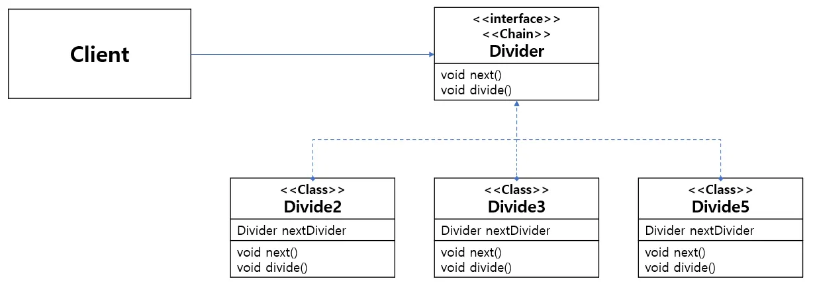
    

**🟢 장점: 유연한 구조**

**1. 결합도를 낮춘다 (Decoupling)**

- 요청자는 구체적으로 누가 처리하는지 몰라도 되므로, 시스템 내부 구조가 변경되어도 요청자 코드는 안전합니다.

**2. 체인의 구조 변경이 쉽다 (유연성)**

- 새로운 처리 단계(예: 로깅 필터)를 추가하거나 순서를 바꿀 때, 기존 코드를 수정할 필요 없이 체인 연결 설정만 바꾸면 됩니다.

**🔴 단점: 디버깅과 무한 루프**

**1. 디버깅이 어렵다**

- 요청이 체인을 따라 이동하므로, 도대체 어디서 처리가 되었는지, 혹은 어디서 막혔는지 흐름을 추적하기가 까다로울 수 있습니다.

**2. 사이클(Cycle)이 생길 위험이 있다**

- 설정을 잘못해서 A가 B를 호출하고, B가 다시 A를 호출하게 되면 **무한 루프**에 빠져 스택 오버플로우(StackOverflow)가 발생할 수 있습니다.

**3. 아무도 처리를 안 할 수도 있다**

- 체인 끝까지 갔는데도 처리하는 객체가 없다면, 요청이 붕 떠버리는(무시되는) 상황이 발생할 수 있으므로 이에 대한 예외 처리가 필요합니다.

Spring Security의 필터 체인

> "여러분이 스프링 시큐리티를 쓸 때, 로그인 요청이 들어오면 CorsFilter → CsrfFilter → UsernamePasswordAuthenticationFilter 순서로 10개가 넘는 필터를 거치게 됩니다.
> 
> 
> *이게 바로 **책임 연쇄 패턴**의 결정체입니다. 앞단에서 ID/PW가 틀리면 다음 체인으로 안 넘기고 바로 튕겨내죠. 개발자는 이 체인 중간에 '나만의 인증 필터'를 쏙 끼워 넣을 수도 있습니다."*
> 

---

## 🎮 커맨드 패턴(Command Pattern)

보통 우리는 객체에게 일을 시킬 때 `tv.turnOn()`처럼 메소드를 직접 호출합니다. 하지만 **"나중에 켜줘"**라거나 **"방금 켠 거 취소해줘"**라고 하려면 어떻게 해야 할까요? 메소드 호출 자체를 **'캡슐'**에 담아 객체로 만들면 가능합니다. 이것이 바로 **커맨드 패턴**입니다.

> "요청(Request)을 객체의 형태로 캡슐화하여, 사용자가 보낸 요청을 나중에 이용할 수 있도록 매개변수화하거나, 요청을 대기열(Queue)에 넣거나, 실행을 취소(Undo)할 수 있게 하는 패턴"
> 

쉽게 말해 **'동사(행동)'를 '명사(객체)'로 만드는 것**입니다.

- **Before:** `jump()` (메소드 호출, 바로 실행됨)
- **After:** `new JumpCommand()` (객체, 저장했다가 원할 때 `.execute()`로 실행 가능)

**◼ 언제 사용하나요? (Why?)**

**1. 요청을 보내는 사람(Invoker)과 받는 사람(Receiver)을 완전히 분리하고 싶을 때**

- **상황:** 리모컨 버튼을 만드는 사람은 버튼이 눌렸을 때 '불이 켜질지', '음악이 나올지' 몰라도 됩니다. 그저 "설정된 커맨드를 실행한다"는 기능만 있으면 됩니다.

**2. 실행 취소(Undo)나 재실행(Redo) 기능이 필요할 때**

- 명령이 객체로 되어 있으므로, `execute()` 반대되는 `undo()` 메소드를 구현해두면 실행 전 상태로 되돌리기 쉽습니다. (예: 텍스트 에디터의 Ctrl+Z)

- 예제코드

```java
//커맨드 정의//
public interface Command {
	void run();
}

```

```java
//복사하기 커맨드 작성//
public class Copy{
	void copy(){
    	System.out.println("복사하기");
    }
}

public class CopyOnCommand implements Command{
	Copy copy;

    CopyOnCommand(Copy copy){
    	this.copy = copy;
    }

    @Override
    void run(){
    	copy.copy();
    }
}

```

```java
//붙여넣기 커맨드 작성//
public class Paste{
	void paste(){
    	System.out.println("붙여넣기");
    }
}

public class PasteOnCommand implements Command{
	Paste paste;

    PasteOnCommand(Paste paste){
    	this.paste = paste;
    }

    @Override
    void run(){
    	paste.paste();
    }
}

```

```java
//닫기 커맨드 작성//
public class Exit{
	void exit(){
    	System.out.println("창 닫기");
    }
}

public class ExitOnCommand implements Command{
	Exit exit;

    ExitOnCommand(Exit exit){
    	this.exit = exit;
    }

    @Override
    void run(){
    	exit.exit();
    }
}

```

```java
//실행하는 객체 정의//
public class Window {
	Command c;

    public void setCommand(Command c){
    	this.c = c;
    }

    public void launch(){
    	c.run();
    }
}

```

```java
//테스트 코드//
public class CommandPatternTest{
	public static void main(String[] args) throws IOException{
    	BufferedReader br = new BufferedReader(new InputStreamReader(System.in));

    	Copy c = new Copy();
        Paste p = new Paste();
        Exit e = new Exit();

    	Command copy = new CopyOnCommand(c);
        Command paste = new PasteOnCommand(p);
        Command exit = new ExitOnCommand(e);

        Window window = new Window();

        String comm = br.readLine();

        if(comm.equals("CTRLC")){
        	window.setCommand(copy);
            window.launch();
        }
        else if(comm.equals("CTRLV")){
       	 	window.setCommand(paste);
            window.launch();
        }
        else if(comm.equals("ALTF4")){
        	window.setCommand(exit);
            window.launch();
        }
    }
}

```

- 예제코드 UML
    
    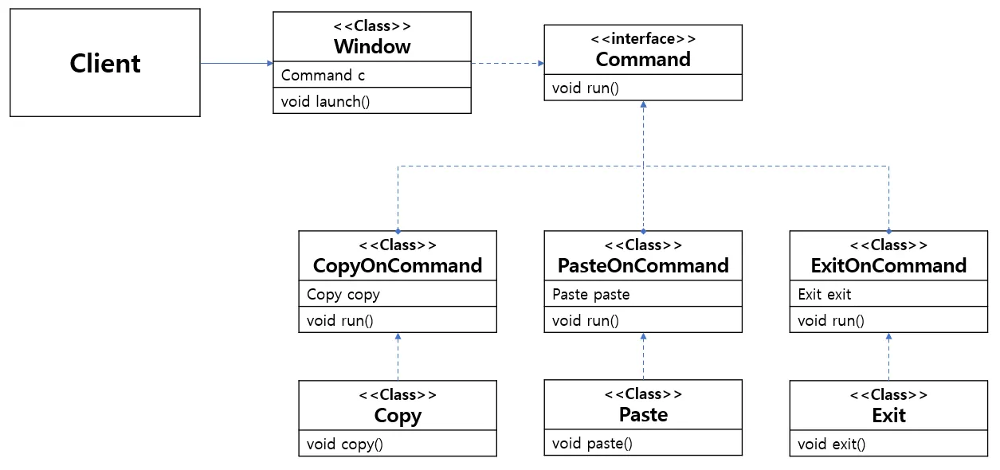
    

**🟢 장점: 유연함과 확장성**

**1. 작업을 수행하는 객체와 요청하는 객체를 분리한다 (결합도 감소)**

- 리모컨(Invoker)은 TV(Receiver)의 내부 로직을 전혀 몰라도 됩니다. 그냥 `Command.execute()` 버튼만 누르면 됩니다.

**2. 새로운 명령을 추가하기 쉽다 (OCP 준수)**

- 새로운 기능(예: 에어컨 켜기)이 추가되어도 리모컨 코드는 수정할 필요가 없습니다. `AirConCommand` 클래스만 새로 만들어서 끼워 넣으면 됩니다.

**🔴 단점: 클래스 폭발**

**1. 클래스가 너무 많아진다**

- 간단한 동작 하나하나마다 클래스(`JumpCommand`, `WalkCommand`, `AttackCommand`...)를 만들어야 하므로 프로젝트 전체의 클래스 개수가 늘어나 복잡해질 수 있습니다.

---

## 🗣️ 인터프리터 패턴(Interpreter Pattern)

우리가 사용하는 **SQL**이나 **정규표현식(Regex)**은 자바 코드가 아닌데도 컴퓨터가 이해하고 실행합니다. 누군가가 이 언어의 문법을 분석하고 해석해 주기 때문이죠. 이렇게 "언어의 문법을 정의하고 해석하는 역할"을 만드는 것이 바로 **인터프리터 패턴**입니다.

> "문법 규칙을 클래스로 정형화하여, 일련의 규칙으로 정의된 언어(문장)를 해석하는 패턴"
> 

쉽게 말해 **'나만의 언어'**와 **'번역기'**를 만드는 것입니다.

- **Expression(표현식):** 문법 규칙 하나하나를 클래스로 만듭니다. (예: `AddExpression`, `SubtractExpression`)
- **Context:** 해석할 문장 데이터를 담고 있습니다.

**◼ 언제 사용하나요? (Why?)**

**1. 정의된 문법에 따라 해석이 필요한 언어가 있을 때**

- 간단한 계산기(`"1 + 2 * 3"`)나 매크로 명령어 등을 구현해야 할 때 사용합니다.

**2. 문법이 단순하고, 반복적으로 등장하는 문제를 해결할 때**

- 복잡한 로직을 매번 코드로 짜는 대신, 짧은 명령어(스크립트) 하나로 실행하고 싶을 때 유용합니다.

- 예제코드 - 출처(https://always-intern.tistory.com/11)

```java
//인터프리터 인터페이스 정의//
public interface Expression {
	boolean interpreter(String con);
}

```

```java
//데이터 객체(터미널) 정의//
public class TerminalExpression implements Expression{
	String data;

	public TerminalExpression(String data){
    	this.data = data;
    }

    @Override
    public boolean interpreter(String con){
    	if(con.contains(data)) return true;
        else return false;
    }
}

```

```java
//규칙 정의//
public class OrExpression implements Expression{
	Expression expr1;
    Expression expr2;

    public OrExpression(Expression expr1, Expression expr2){
    	this.expr1 = expr1;
        this.expr2 = expr2;
    }

    public boolean interpreter(String con){
    	return expr1.interpreter(con) || expr2.interpreter(con);
    }
}

```

```java
//규칙 정의//
public class AndExpression implements Expression{
	Expression expr1;
    Expression expr2;

    public AndExpression(Expression expr1, Expression expr2){
    	this.expr1 = expr1;
        this.expr2 = expr2;
    }

    public boolean interpreter(String con){
    	return expr1.interpreter(con) && expr2.interpreter(con);
    }
}

```

```java
//테스트 코드//
public class Main{
	public static void main(String[] args){
    	Expression person1 = new TerminalExpression("David");
        Expression person2 = new TerminalExpression("Lisa");
        Expression person3 = new TerminalExpression("John");

        Expression isSingle = new OrExpression(person1, person2);
        Expression isCouple = new AndExpression(person1, person2);
        Expression isTriangle = new AndExpression(person3, isSingle);

        System.out.println("isSingle.interpreter");
        //David, Lisa중 한명이라도 있으면 true
        System.out.println(isSingle.interpreter("David, John"));

        System.out.println("isCouple.interpreter");
        //David, Lisa 둘다 있으면 true
        System.out.println(isCouple.interpreter("David, Lisa"));
        System.out.println(isCouple.interpreter("David, John"));

        System.out.println("isTriangle.interpreter");
        //John은 무조건 존재하고 David Lisa중 하나라도 있으면 true
        System.out.println(isTriangle.interpreter("David, Lisa, Ann"));
        System.out.println(isTriangle.interpreter("David, John, Ann"));
    }
}

//출력//
isSingle.interpreter
true
isCouple.interpreter
true
false
isTriangle.interpreter
false
true

```

- 예제코드 UML
    
    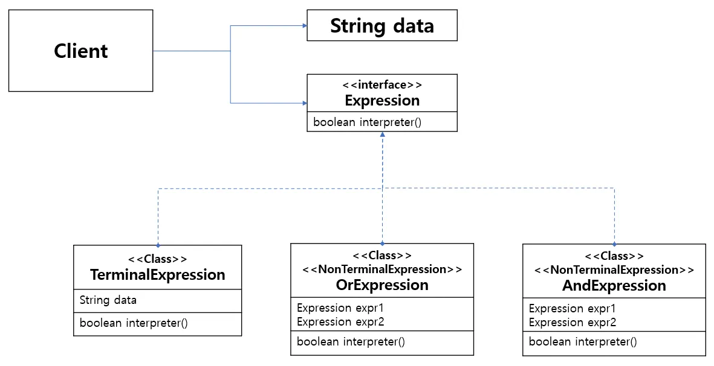
    

**🟢 장점: 확장의 용이성**

**1. 문법을 추가하거나 수정하기 쉽다 (OCP)**

- 각 문법 규칙이 하나의 클래스로 되어 있습니다. 새로운 규칙이 필요하면 클래스 하나만 추가하면 됩니다. (기존 코드를 건드리지 않아도 됨)

**🔴 단점: 복잡도와 성능**

**1. 문법이 복잡해지면 유지보수가 지옥이 된다**

- 규칙이 많아질수록 클래스 개수가 폭발적으로 늘어납니다.
- SQL처럼 복잡한 문법을 인터프리터 패턴만으로 구현하려면 구조가 너무 거대해지고, 해석 속도도 느려집니다. (그래서 실제 컴파일러는 훨씬 복잡한 최적화 알고리즘을 씁니다.)

*이 패턴을 직접 구현할 일은 드물지만, 이미 매일 쓰고 있습니다. 바로 **스프링의 SpEL**입니다.*

`*@Value("#{systemProperties['user.timezone']}")` 처럼 쓰는 코드가 기억나시나요? 저 문자열을 스프링이 해석해서 실제 값으로 바꿔주죠? 스프링 내부의 **인터프리터**가 동작한 덕분입니다.*

---

## 🔄 반복자 패턴(Iterator Pattern)

배열(`Array`)을 쓸 때는 `i++`로 순회하고, 리스트(`List`)를 쓸 때는 `.get(i)`로 순회하고, 해시맵(`Map`)은 또 다르게 순회해야 한다면 얼마나 복잡할까요?
자료구조가 무엇이든 상관없이 **"그냥 다음 거 내놔(Next)"**라고 통일된 방식으로 순회하고 싶을 때 사용하는 것이 **이터레이터 패턴**입니다.

> "컬렉션(집합체)의 내부 구조를 노출하지 않고, 들어있는 모든 항목에 순차적으로 접근할 수 있는 방법을 제공하는 패턴"
> 

쉽게 말해 **'만능 리모컨의 [다음] 버튼'**입니다. 내부가 테이프인지, CD인지, MP3 파일인지 몰라도 [다음] 버튼만 누르면 다음 곡이 나옵니다.

**◼ 언제 사용하나요? (Why?)**

**1. 컬렉션의 복잡한 내부 구조를 숨기고 싶을 때**

- 데이터가 내부적으로 배열로 되어 있는지, 링크드 리스트로 되어 있는지, 복잡한 트리로 되어 있는지 클라이언트는 몰라도 됩니다. 그저 `iterator.next()`만 알면 됩니다.

**2. 어떤 객체를 순회하는 코드의 중복을 줄이고 통일하고 싶을 때**

- `for (int i=0; ...)` 같은 방식을 쓰면 자료구조마다 코드가 달라집니다. 이터레이터를 쓰면 모든 컬렉션을 **동일한 `while`문 하나**로 순회할 수 있습니다.

- 예제코드

```java
//반복자 인터페이스 정의//
public interface Iterator {
	boolean hasNext();
    Object next();
}

public interface Container{
	Iterator getIterator();
}

```

```java
//저장할 객체 정의//
public class Paper{
	private String context;
    private String size;

    Paper(String context, String size){
    	this.context = context;
        this.size = size;
    }

    public getContext(){
    	return this.context;
    }

    public getSize(){
    	return this.size;
    }
}

//인터페이스 구현//
public class PaperIter implements Iterator{
	private List<Paper> file;
	int cur = 0;

    PaperIter(List<Paper> file){
    	this.file = file;
    }

    @Override
	boolean hasNext(){
    	return cur < file.size();
    }

    @Override
    Object next(){
    	if(hasNext()){
        	return file.get(cur++);
        }
        else return null;
    }
}

public class File implements Container{
	private List<Paper> file;

    File(List<Paper> file){
    	this.file = file;
    }

    @Override
    Iterator getIterator(){
    	return new PaperIter(this.file);
    }
}

```

```java
//저장할 객체 정의//
public class Car{
	private String name;
    private int maxSpeed;

    Car(String name, int maxSpeed){
    	this.name = name;
        this.maxSpeed = maxSpeed;
    }

    public getName(){
    	return this.name;
    }

    public getMaxSpeed(){
    	return this.maxSpeed;
    }
}

//인터페이스 구현//
public class CarIter implements Iterator{
	private List<Car> garage;
	int cur = 0;

    CarIter(List<Car> garage){
    	this.garage = garage;
    }

    @Override
	boolean hasNext(){
    	return cur < garage.size();
    }

    @Override
    Object next(){
    	if(hasNext()){
        	return garage.get(cur++);
        }
        else return null;
    }
}

public class Garage implements Container{
	private List<Car> garage;

    Garage(List<Car> garage){
    	this.garage = garage;
    }

    @Override
    Iterator getIterator(){
    	return new CarIter(this.garage);
    }
}

```

```java
//테스트 코드//
public class IteratorPatternTest{
	public static void main(String[] args){
    	List<Paper> file = new ArrayList<>();
        List<Car> garage = new ArrayList<>();

        file.add(new Paper("종이1", "A4"));
        file.add(new Paper("종이2", "A3"));
        file.add(new Paper("종이3", "B4"));

        garage.add(new Car("SUV", 150));
        garage.add(new Car("Sonata", 160));
        garage.add(new Car("Ferrari", 200));

        File f = new File(file);
        Garage g = new Garage(garage);

        for(Iterator it = new File.getIterator(); it.hasNext();){
        	Paper p = (Paper)it.next();
            System.out.println("내용: "+ p.getContext() + " "
            									+ "용지 크기: "+ p.getSize());
        }

        for(Iterator it = new Garage.getIterator(); it.hasNext();){
        	Car c = (Car)it.next();
            System.out.println("브랜드이름: "+ c.getContext() + " "
            									+ "최고속도: "+ c.getSize());
        }
    }
}

```

- 예제코드 UML
    
    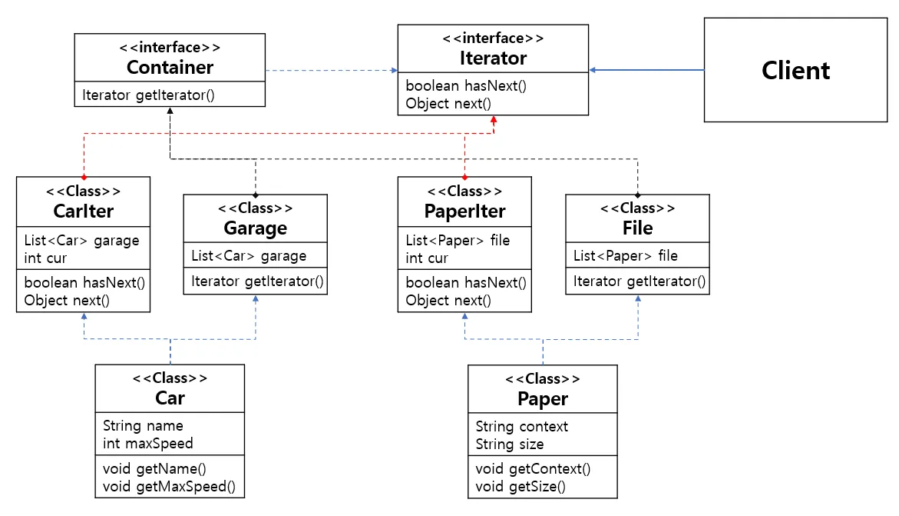
    

**🟢 장점: 통일성과 유연성**

**1. 단일 책임 원칙(SRP) 준수**

- '데이터를 저장하는 역할'(컬렉션)과 '데이터를 순회하는 역할'(이터레이터)을 분리합니다. 덕분에 컬렉션 클래스가 가벼워집니다.

**2. 개방-폐쇄 원칙(OCP) 준수**

- 나중에 새로운 자료구조(예: `Graph`)를 추가해도, 공통 인터페이스(`Iterator`)만 구현하면 기존의 순회 코드를 수정할 필요가 없습니다.

**3. 병렬 순회가 가능하다**

- 하나의 컬렉션에 대해 여러 개의 이터레이터를 동시에 만들 수 있습니다. 즉, A는 1번부터 읽고 있는데, B는 5번부터 읽는 등 서로 간섭 없이 독립적인 순회가 가능합니다.

**🔴 단점: 과도한 구조화**

**1. 단순한 구조에서는 오히려 비효율적이다**

- 간단한 배열 하나를 도는데 굳이 이터레이터 객체까지 만들어서 호출하는 것은 오버헤드(Overhead)가 될 수 있습니다. 단순한 `for`문이 더 빠르고 직관적일 때가 많습니다.

---

> 자바의 Iterable 인터페이스를 구현하면, 그 객체는 **향상된 for문 (for (Type t : collection))**을 사용할 수 있게 됩니다. 이 for-each 문법이 내부적으로 컴파일될 때 **이터레이터 패턴(hasNext(), next())**으로 바뀐다는 사실을 알고 계셨나요?
> 

```jsx
// 우리가 쓰는 코드
for (String name : names) {
    System.out.println(name);
}

// 실제 컴파일 후 동작 (Iterator Pattern)
Iterator<String> i = names.iterator();
while (i.hasNext()) {
    String name = i.next();
    System.out.println(name);
}
```

---

## 🤝 중재자 패턴(Mediator Pattern)

비행기 조종사들이 서로 직접 무전하면서 "나 지금 착륙해도 돼?"라고 싸운다면 공항은 아수라장이 될 것입니다. 대신 조종사들은 오직 **'관제탑'** 하고만 대화합니다. 비행기끼리는 서로 알 필요가 없죠. 이 관제탑 역할을 하는 것이 바로 **중재자 패턴**입니다.

> "객체들 간의 복잡한 상호작용을 캡슐화하여 하나의 클래스(중재자)에 위임하고, 객체들이 서로 직접 참조하지 않도록 하여 결합도를 낮추는 패턴"
> 

쉽게 말해 **그물망(Mesh)처럼 얽힌 관계를 성형(Star) 구조로 바꾸는 것**입니다.

- **Before:** A가 B, C, D를 다 알아야 함. (복잡도 N * N)
- **After:** A, B, C, D는 모두 **M(중재자)**만 바라봄. (복잡도 N)

**◼ 언제 사용하나요? (Why?)**

**1. 객체들 사이에 너무 많은 관계가 얽혀 있을 때 (스파게티 코드)**

- A를 수정했는데 B가 터지고, C도 터지는 상황이라면 의존성이 너무 복잡한 것입니다. 이 연결 고리를 끊고 싶을 때 사용합니다.

**2. 상호작용 규칙이 자주 변경될 때**

- 객체 간의 통신 로직이 각 클래스에 분산되어 있다면, 규칙이 바뀔 때마다 모든 클래스를 수정해야 합니다. 이를 중재자 한곳에 모아서 관리하고 싶을 때 사용합니다.

- 예제코드
    - 사고를 총괄하는 부서에서 시민들의 신고를 받고 일을 처리하는 코드

```java
//요청하는 객체 인터페이스 정의//
public interface Citizen{
	Office o; // 총괄부서
}

//요청하는 객체 인터페이스 구현//
public Class Person{
	Office o; // 총괄부서
}

```

```java
//경찰서 객체 정의//
public class Police{
	Office o; // 총괄부서

	void police(){
    	System.out.println("경찰 출동");
    }

    //다른기관에 도움 요청//
    void helpFire(){
    	o.water(); //총괄부서에 요청
    }

    void helpHospital(){
    	o.ambulance(); //총괄부서에 요청
    }

}

```

```java
//소방서 객체 정의//
public class FireStation{
	Office o; // 총괄부서

	void water(){
    	System.out.println("소방차 출동");
    }

    //다른기관에 도움요청//
    void helpPolice(){
    	o.police(); //총괄부서에 요청
    }

    void helpHospital(){
    	o.ambulance(); //총괄부서에 요청
    }
}

```

```java
//병원 객체 정의//
public class Hospital{
	Office o; // 총괄부서

	void ambulance(){
    	System.out.println("구급차 출동");
    }

    //다른기관에 도움 요청//
    void helpPolice(){
    	o.police(); //총괄부서에 요청
    }

    void helpFire(){
    	o.water(); //총괄부서에 요청
    }
}

```

```java
//중재자 인터페이스 정의//
public interface Office{
	void police();
    void water();
    void ambulance();
}

//중재자 인터페이스 구현//
public class O{
	Police p = new Police();
	FireStation f = new FireStation();
	Hospital h = new Hospital();

	void police(){
        p.police();
    }

    void water(){
        f.water();
    }

    void ambulance(){
        h.ambulance();
    }
}

```

```java
//테스트코드//
public class MediatorTest{
	public static void main(String[] args){
    	Citizen c1 = new Person();
        Citizen c2 = new Person();
        Police p1 = new Police();
        Hospital h1 = new Hospital();

        c1.o.police();
        c2.o.ambulance();
        p1.helpFire();
        h1.helpPolice();
    }
}

//출력//
경찰 출동
구급차 출동
소방차 출동
경찰 출동

```

- 예제코드 UML
    
    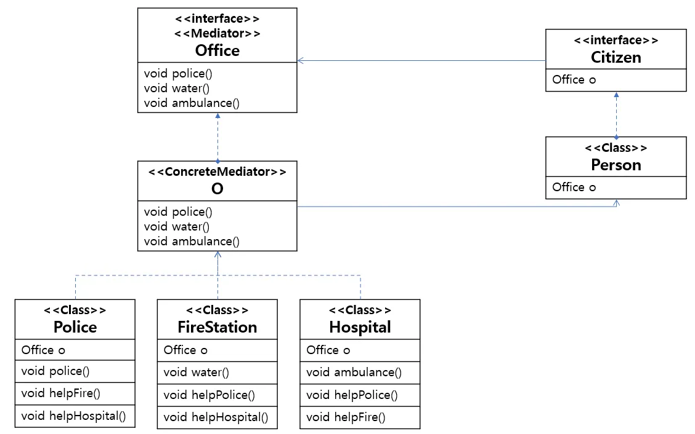
    

**🟢 장점: 질서 정연함**

**1. 결합도(Coupling)가 획기적으로 줄어든다**

- 구성요소(Colleague)들은 오직 중재자만 알면 됩니다. 다른 구성요소가 어떻게 생겼는지, 심지어 존재하는지조차 몰라도 됩니다.
- **예시:** 경찰은 병원 전화번호를 몰라도, 중재자(본부)에게 "부상자 발생"이라고만 알리면 본부가 알아서 병원을 호출합니다.

**2. 상호작용의 흐름을 이해하기 쉽다**

- 복잡한 로직이 중재자 클래스 하나에 모여 있으므로, 흐름을 파악하려면 중재자 코드만 보면 됩니다.

**🔴 단점: 중재자의 과부하**

**1. 중재자가 '신(God Object)'이 될 위험이 있다**

- 모든 상호작용 로직을 한곳에 몰아넣다 보니, 중재자 클래스가 너무 거대해지고 복잡해져서 유지보수가 힘들어질 수 있습니다.

**2. 재사용이 어렵다**

- 중재자에 포함된 로직은 해당 애플리케이션의 특정한 업무 규칙에 종속되므로, 다른 프로젝트에서 그대로 가져다 쓰기가 어렵습니다.

| **구분** | **퍼사드 패턴 (Facade)** | **중재자 패턴 (Mediator)** |
| --- | --- | --- |
| **방향** | **단방향** (One-way) | **양방향** (Multi-way) |
| **목적** | "복잡한 걸 **단순하게** 쓰고 싶어" | "복잡한 **관계를 정리**하고 싶어" |
| **관계** | 클라이언트는 퍼사드를 알지만,
퍼사드 뒤의 객체들은 퍼사드를 모름 | 중재자와 참여 객체들은
서로를 알고 있음 |
| **비유** | **호텔 프론트** (손님 → 직원) | **채팅방 서버** (유저 ↔ 서버 ↔ 유저) |

---

## 🔙 메멘토 패턴(Memento Pattern)

게임을 하다가 보스 방에 들어가기 직전, 우리는 **'저장(Save)'**을 합니다. 그리고 보스에게 지면 다시 그 시점의 **'세이브 파일'**을 불러와서(Load) 재도전하죠. 객체지향 프로그래밍에서 이 세이브 파일을 만드는 것이 바로 **메멘토 패턴**입니다.

> "객체의 상태(State)를 캡슐화하여 저장해 두었다가, 나중에 필요할 때 해당 객체를 그 시점의 상태로 되돌릴(Restore) 수 있게 하는 패턴"
> 

핵심은 **캡슐화(Encapsulation)를 깨지 않고** 객체의 내부 상태를 저장한다는 점입니다. 외부에서는 저장된 내용이 뭔지 몰라도(보안), 그냥 "저장해 줘"라고 맡겨두기만 하면 됩니다.

**◼ 언제 사용하나요? (Why?)**

**1. 실행 취소(Undo)나 다시 실행(Redo) 기능을 만들 때**

- 워드 프로세서, 그래픽 툴, 계산기 등에서 "방금 한 작업 취소해 줘" 기능을 구현할 때 필수적입니다.

**2. 객체의 현재 상태를 스냅샷(Snapshot)으로 찍어두고 싶을 때**

- 시스템이 오류로 멈췄을 때를 대비해 체크포인트를 만들거나, 트랜잭션 롤백 기능을 구현할 때 사용합니다.

- 예제코드
    - 게임의 세이브 포인트를 구현해보자

```java
//메멘토 클래스 정의//
public class Memento{
	private int x;
  private int y;

  Memento(int x, int y){
  	this.x = x;
      this.y = y;
  }

  public int getX(){
  	return x;
  }

  public int getY(){
  	return y;
  }
}

```

```java
//상태 정보 객체 정의//
public class Location{
	//캐릭터 현재 위치좌표//
	private int x;
  private int y;

  public void setX(int x){
  	this.x = x;
  }

  public void setY(int y){
  	this.y = y;
  }

  public int getX(){
  	return x;
  }

  public int getY(){
  	return y;
  }

  //세이브 포인트 도착하면 저장해두기//
  public Memento savePoint(){
  	return new Memento(x,y);
  }

  //가장 최근 세이브포인트 좌표 불러오기//
  public void getSavePoint(Memento memento){
  	x = memento.getX();
      y = memento.getY();
  }
}

```

```java
//상태 정보 저장 객체(caretaker) 정의//
public class SavePoint{
	private Stack<Memento> memento = new Stack<>();

    //세이브 포인트 저장//
    public void add(Memento l)
    	memento.push(l);

    //세이브포인트 불러오기//
    public Memento get(){
    	return memento.pop(); //한번만 사용가능한 세이브 포인트
        //return memento.peek(): //여러번 죽어도 다시 돌아오는 세이브 포인트
    }
}

```

```java
//테스트 코드//
public class MementoTest{
	public static void main(String[] args){
    	Location l = new Location(): //캐릭터 현재 위치
        SavePoint save = new SavePoint();//세이브포인트 저장객체

        l.setX(10);
        l.setY(20);
        System.out.println("캐릭터는 현재 x: " + l.x+ " y: " + l.y + "에 있습니다.");

        //세이브포인트 도착//
        l.setX(20); //세이브포인트 x좌표
        l.setY(30); //세이브포인트 y좌표
        save.add(l.savePoint());
        System.out.println("캐릭터는 현재 x: " + l.x+ " y: " + l.y + "에 있습니다.");

        l.setX(30);
        l.setY(5);
        System.out.println("캐릭터는 현재 x: " + l.x+ " y: " + l.y + "에 있습니다.");

        //캐릭터가 죽음//
        System.out.println("가장 최근 세이브 포인트로 돌아갑니다.");
        l.getSavePoint(save.get()); //가장 최근 세이브 포인트로 복귀
        System.out.println("캐릭터는 현재 x: " + l.x+ " y: " + l.y + "에 있습니다.");
    }
}

//출력//
캐릭터는 현재 x: 10 y: 20에 있습니다.
캐릭터는 현재 x: 20 y: 30에 있습니다.
캐릭터는 현재 x: 30 y: 5에 있습니다.
가장 최근 세이브 포인트로 돌아갑니다.
캐릭터는 현재 x: 20 y: 30에 있습니다.

```

- 예제코드 UML
    
    
    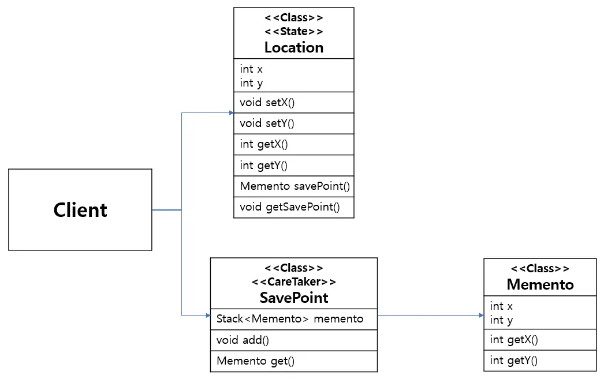
    

**🟢 장점: 안전한 복구**

**1. 캡슐화를 유지하면서 상태를 저장할 수 있다 (보안성)**

- 객체의 `private`한 내부 정보를 외부에 노출하지 않고도 상태를 저장하고 복원할 수 있습니다. 저장소(Caretaker)는 메멘토 박스를 보관만 할 뿐, 박스 안의 내용물(Originator의 상태)은 볼 수 없습니다.

**2. 복구 기능을 깔끔하게 구현할 수 있다**

- 상태를 저장하고 복원하는 책임을 별도의 메멘토 객체로 분리하므로, 원래 객체(Originator)의 코드가 단순해집니다.

**🔴 단점: 메모리 비용**

**1. 메모리 용량을 많이 차지한다**

- 상태를 저장할 때마다 객체의 복사본(스냅샷)을 생성해야 합니다. 객체의 크기가 크거나, 저장 빈도가 높다면 메모리 사용량이 급격히 늘어날 수 있습니다.

---

## 👁‍🗨 옵저버 패턴(Observer Pattern)⭐

유튜브 채널을 구독하면, 유튜버가 새 영상을 올릴 때마다 구독자들에게 자동으로 알림이 갑니다. 유튜버는 누가 구독했는지 일일이 알 필요가 없죠. 그저 "영상 올렸다!"고 외치면 끝입니다. 이것이 바로 **옵저버 패턴**입니다.

> "한 객체의 상태가 바뀌면, 그 객체에 의존하는 다른 객체들(구독자들)에게 연락이 가고, 자동으로 내용이 갱신되는 1:N 의존성 정의 패턴"
> 
- **Subject (발행자/유튜버):** 상태를 변경하는 주체.
- **Observer (구독자):** 상태 변경 알림을 받는 객체들.

**◼ 언제 사용하나요? (Why?)**

**1. "한 놈이 변하면, 다른 놈들도 덩달아 뭘 해야 할 때"**

- 어떤 객체의 상태 변화가 있을 때, 연관된 여러 객체가 무언가를 수행해야 하는데 그들이 누구인지 몰라도 될 때 사용합니다.

**2. 이벤트 처리가 필요한 경우**

- 버튼 클릭, 데이터 도착 등 이벤트가 발생했을 때 이를 처리하는 리스너(Listener) 구조를 만들 때 필수적입니다.

- 예제코드
    - 사내 안내방송

```java
//변하는 객체의 인터페이스 정의//
public interface Building{
	void add(Observer o);
    void delete(Observer o);
    void notify(String s);
}

//변하는 객체의 인터페이스 구현//
public class Guarder implements Building{
	private List<Observer> list = new ArrayList<>();

    void add(Observer o){
    	list.add(o);
    }
    void delete(Observer o){
    	list.remove(o);
    }
    void notify(String s){
    	for(Observer o : list){
        	o.update(String s);
        }
    }
}

```

```java
//옵저버 인터페이스 정의//
public interface Observer{
	void update(String s);
}

//옵저버 인터페이스 구현//
public class OfficeWorker implements Observer{
	void update(String s){
    	System.out.println("사무직들은 " + s + "방송을 들음");
    }
}

//옵저버 인터페이스 구현//
public class Engineer implements Observer{
	void update(String s){
    	System.out.println("기술자들은 " + s + "방송을 들음");
    }
}

```

```java
//테스트 코드//
public class ObserverPatternTest{
	public static void main(String[] args){
    	Observer o1 = new OfficeWorker();
        Observer o2 = new Engineer();

        Building b = new Guarder();
        b.add(o1);
        b.add(o2);

        b.notify("냉방 가동 안내");
    }
}

//출력//
사무직들은 냉방 가동 안내방송을 들음
기술자들은 냉방 가동 안내방송을 들음

```

- 예제코드 UML
    
    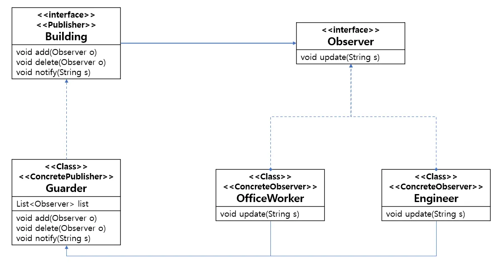
    

**🟢 장점: 느슨한 결합 (Loose Coupling)**

**1. 발행자와 구독자는 서로를 모른다**

- 발행자(Subject)는 구독자(Observer)가 구체적으로 무슨 일을 하는지 알 필요가 없습니다. 그저 `notify()`만 호출하면 됩니다.
- 덕분에 구독자를 추가하거나 삭제해도 발행자 코드는 수정할 필요가 없습니다. (OCP 준수)

**🔴 단점: 순서와 디버깅**

**1. 알림 순서를 보장할 수 없다**

- 일반적인 옵저버 패턴에서는 구독자들이 등록된 순서대로 알림을 받는다는 보장이 없습니다. (랜덤 순서 실행)

**2. 메모리 누수(Memory Leak) 위험**

- 구독을 하고 나서 취소(unsubscribe)를 안 하면, 더 이상 필요 없는 객체인데도 계속 알림을 받으며 메모리에 남아있는 **'Lapsed Listener Problem'**이 발생할 수 있습니다.

스프링의 Event Listener

> "백엔드 개발에서 '회원가입' 후에 '환영 이메일'을 보내야 한다면? 회원가입 로직 안에 이메일 발송 코드를 넣으면 결합도가 높아집니다.
> 
> - 이때 **스프링의 `@EventListener` (옵저버 패턴)***를 사용합니다. 회원 서비스는 "가입 완료 이벤트"만 던지고, 이메일 서비스가 그 이벤트를 구독해서 메일을 보내는 것이죠. 서로 코드를 전혀 건드리지 않고도 연결할 수 있는 **고급 기술**입니다."*

### 중재자 패턴 vs 옵저버 패턴

두 패턴 모두 **1:N 관계**를 다루지만, **통신의 목적과 방향**이 다릅니다.

| **구분** | **중재자 패턴 (Mediator)** | **옵저버 패턴 (Observer)** |
| --- | --- | --- |
| **핵심** | **"가운데서 조율한다"** | **"퍼트린다 (Broadcasting)"** |
| **방향** | **양방향** (객체 ↔ 중재자) | **단방향** (발행자 → 구독자) |
| **역할** | 객체들의 통신을 제어하고 관리함 | 상태 변화를 단순히 통보함 |
| **비유** | **관제탑** (비행기들이 관제탑을 통해 소통) | **유튜브 알림** (유튜버가 영상 올리면 구독자에게 전송) |

---

## ⚛ 상태 패턴(State Pattern)

스마트폰의 '전원 버튼'을 생각해 봅시다. 화면이 **켜져 있을 때** 누르면 화면이 꺼지고, **꺼져 있을 때** 누르면 화면이 켜집니다. 똑같은 버튼을 눌렀는데 **현재 상태**에 따라 행동이 달라지죠? 이것을 코드로 구현하는 것이 **상태 패턴**입니다.

> "객체 내부 상태(State)에 따라 스스로 행동을 변경할 수 있게 하는 패턴"
> 

마치 객체가 **자신의 클래스를 바꾸는 것처럼** 보입니다.

- **핵심:** 상태를 `enum`이나 `int` 변수로 관리하는 것이 아니라, **상태 하나하나를 '클래스'로 만듭니다.** 그리고 행동을 그 클래스에게 **위임(Delegation)**합니다.

**◼ 언제 사용하나요? (Why?)**

**1. 상태에 따라 행동이 달라지는 분기처리가 너무 많을 때 (`if-else` 지옥)**

- **Before:**Java
    
    `if (state == STANDING) jump();
    else if (state == JUMPING) doubleJump();
    else if (state == DUCKING) nothing();`
    
    이렇게 상태가 늘어날 때마다 `if-else`가 끝도 없이 길어지는 코드를 구원할 때 사용합니다.
    

**2. 런타임에 객체의 상태가 자주 바뀌고, 그에 따라 행동도 바뀌어야 할 때**

- 게임 캐릭터(평상시 → 점프 중 → 공격 중)나 주문 처리(주문 완료 → 결제 완료 → 배송 중) 프로세스 등에 적합합니다.

- 예제코드

```java
//상태 인터페이스 정의//
public interface BatteryState{
	void statePush();
}

//상태 인터페이스 구현//
public class NeedCharge implements BatteryState{
	void statePush(){
    	System.out.println("충전 필요!");
    }
}

//상태 인터페이스 구현//
public class NeedCharge implements BatteryState{
	void statePush(){
    	System.out.println("충전 필요!");
    }
}

//상태 인터페이스 구현//
public class Charging implements BatteryState{
	void statePush(){
    	System.out.println("충전 중...");
    }
}

//상태 인터페이스 구현//
public class ChargeComplete implements BatteryState{
	void statePush(){
    	System.out.println("충전 완료!");
    }
}
```

```java
public class Phone{
	BatteryState bs;

    void setState(Batterystate bs){
    	this.bs = bs;
    }

    void statePush(){
    	bs.statePush();
    }
}

```

```java
//테스트 코드//
public class StatePatternTest{
	public static void main(String[] args){
    	BatteryState lowBattery = new NeedCharge();
        BatteryState chargingBattery = new Charging();
        BatteryState fullBattery = new ChargeComplete();
        Phone p = new Phone();

       	p.setState(lowBattery);
        p.statePush();

        p.setState(chargingBattery);
        p.statePush();

        p.setState(fullBattery);
        p.statePush();
    }
}

//출력//
충전 필요!
충전 중...
충전 완료!

```

- 예제코드 UML
    
    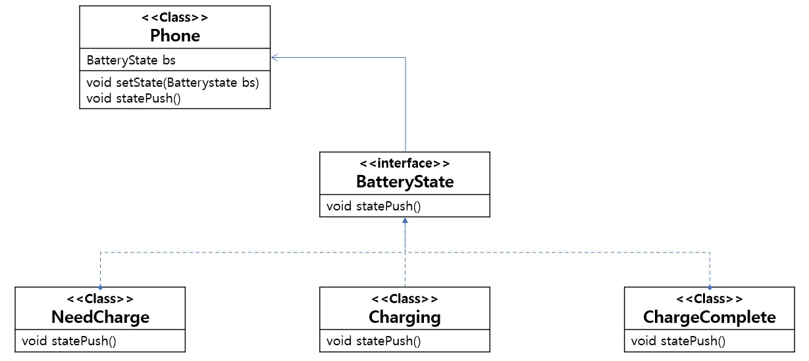
    

**🟢 장점: 코드의 간결화**

**1. 거대한 조건문을 없앨 수 있다**

- 상태별 동작 코드가 각 상태 클래스(`StandingState`, `JumpingState`)로 분산되므로, 메인 로직(`Character`)의 코드가 매우 깔끔해집니다.

**2. 새로운 상태 추가가 쉽다 (OCP)**

- 새로운 상태(예: `SwimmingState`)가 생겨도, 기존 코드를 건드리지 않고 새로운 클래스만 하나 추가하면 됩니다.

**🔴 단점: 클래스 폭발**

**1. 관리해야 할 클래스 수가 늘어난다**

- 상태가 10개면 클래스도 10개를 만들어야 하므로, 상태가 적은 단순한 경우에는 오히려 코드가 복잡해질 수 있습니다.

---

## 🗺 전략 패턴(Strategy Pattern)⭐

RPG 게임에서 캐릭터가 공격을 합니다. **검**을 들면 베기 공격을, **활**을 들면 원거리 공격을 해야겠죠.
이때 `if (무기 == 검) ... else if (무기 == 활) ...` 처럼 코드를 짜면, 무기가 추가될 때마다 코드를 뜯어고쳐야 합니다. 대신 무기(전략)만 쏙 갈아 끼우면 공격 방식이 바뀌도록 만드는 것이 **전략 패턴**입니다.

> "알고리즘군(로직의 모음)을 정의하고 각각을 캡슐화하여, 실행 중에(Runtime) 이들을 교체하여 사용할 수 있게 하는 패턴"
> 

쉽게 말해 **"행동(Method)을 객체(Object)로 감싸서 갈아 끼우는 패턴"**입니다.

- **Context (사용자):** 전략을 사용하는 주체 (예: 게임 캐릭터, 축구 선수)
- **Strategy (전략):** 교체 가능한 행동 인터페이스 (예: 무기, 행동)
- **ConcreteStrategy (구체적 전략):** 실제 행동 구현체 (예: 검, 활 / 슈팅, 패스)

**◼ 언제 사용하나요? (Why?)**

**1. `if-else`나 `switch` 문을 없애고 싶을 때**

- 상황에 따라 다른 로직을 실행해야 하는데, 조건문이 너무 길어지고 복잡해질 때 사용합니다.

**2. 동적으로 행동을 바꾸고 싶을 때**

- 프로그램 실행 중에 로직을 변경해야 할 때(예: 보통 모드 -> 하드 모드 변경) 유용합니다.

- 예제코드

```java
//행위 인터페이스 정의 및 구현//
public interface Behavior{
	public void choice();
}

public class Shoot implements Behavior{
	public void choice() {
    	//슛 관련 코드
    }
}

public class Pass implements Behavior{
	public void choice() {
    	//패스 관련 코드
    }
}

public class Dribble implements Behavior{
	public void choice() {
    	//드리블 관련 코드
    }
}

```

```java
// 행위를 수행할 클래스 정의//
public class Player {
	private Behavior behavior; //하나의 접근점

    public void setBehavior(Behavior behavior){ //선수의 행동을 교환가능
    	this.behavior = behavior;
    }

    public void choice(){
    	if(behavior == null) {
        	//멈추기
        }
       	else{ //선수의 행동을 위임
        	behavior.choice();
        }
    }
}

```

```java
//테스트 코드//
public class main {
	public static void main(String[] args) {
		Player player = new Player();

        player.setBehavior(new Dribble()); //드리블 선택
		player.choice(); //드리블 수행

		player.setBehavior(new Shoot()); //슛 선택
		player.choice();// 슛 수행

        character.setBehavior(new Pass()); // 패스 선택
		player.choice(); //패스 수행
	}
}

```

- 예제코드 UML

    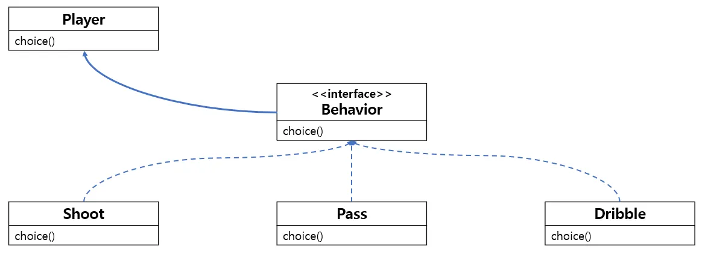
    

개인기 코드 추가

```java

//개인기 코드 추가
public class SkillMove implements Behavior{
	public void choice() {
    	//개인기 관련 코드
    }
}

//코드에 변화를 주지않아도 됨!
public class Player {
	private Behavior behavior; //하나의 접근점

    public void setBehavior(Behavior behavior){ //선수의 행동을 교환가능
    	this.behavior = behavior;
    }

    public void choice(){
    	if(behavior == null) {
        	//멈추기
        }
       	else{ //선수의 행동을 위임
        	behavior.choice();
        }
    }
}

public class main {
	public static void main(String[] args) {
		Player player = new Player();

    player.setBehavior(new Dribble()); //드리블 선택
		player.choice(); //드리블 수행

		player.setBehavior(new Shoot()); //슛 선택
		player.choice();// 슛 수행

    player.setBehavior(new Pass()); // 패스 선택
		player.choice(); //패스 수행

    player.setBehavior(new SkillMove()); // 개인기 선택
		player.choice(); //개인기 수행
        // 코드의 변화 없이 추가만으로 새로운 기능을 수행할 수 있게됨
	}
}

```

**🟢 장점: 확장에는 열려 있고, 변경에는 닫혀 있다 (OCP)**

**1. 새로운 기능을 추가하기가 아주 편하다**

- 새로운 전략(예: '도끼' 무기)이 추가되더라도, 이를 사용하는 캐릭터 클래스나 접근점 코드는 **단 한 줄도 수정할 필요가 없습니다.** 그저 새로운 클래스를 만들어서 주입해주면 끝입니다.

**2. 알고리즘을 사용하는 코드와 알고리즘 구현 코드를 분리한다**

- 비즈니스 로직이 깔끔해지고 유지보수가 쉬워집니다.

**🔴 단점: 클래스 증가와 선택의 책임**

**1. 클래스의 개수가 많아진다**

- 전략 하나당 클래스 하나를 만들어야 하므로, 관리해야 할 파일이 늘어납니다.

**2. 클라이언트가 구체적인 전략을 알아야 한다**

- 전략을 갈아 끼우는 쪽(Client)에서 "지금은 `검`을 써야 해", "지금은 `활`을 써야 해"라고 알고 직접 주입해줘야 합니다.

### 스프링 DI는 전략 패턴이다

> *"여러분이 스프링에서 숨 쉬듯이 사용하는 **DI(의존성 주입)**가 바로 전략 패턴의 결정체입니다.
> 
> 
> `*Service` 코드는 `Repository` 인터페이스만 보고 있죠? 우리가 설정 파일에서 `MySQLRepository`를 `OracleRepository`로 바꿔 끼우면, 서비스 코드 수정 없이 DB가 바뀝니다. 즉, **스프링 컨테이너가 전략(Repository 구현체)을 주입해 주는 전략 패턴 관리자**인 셈입니다."*
> 

| **구분** | **팩토리 패턴 (Factory)** | **전략 패턴 (Strategy)** |
| --- | --- | --- |
| **담당** | **객체 생성 (Creation)** | **객체 사용 (Behavior)** |
| **질문** | "이 객체를 **어떻게(How)** 만들 거야?" | "이 객체로 **무엇을(What)** 할 거야?" |
| **Spring** | **BeanFactory (ApplicationContext)** | **@Autowired (DI)** |
| **역할** | `new` 키워드를 숨기고 객체를 생성해 줌 | 인터페이스 뒤에 숨은 구현체를 갈아 끼움 |

### 전략 패턴 vs 상태 패턴

| **구분** | **전략 패턴 (Strategy)** | **상태 패턴 (State)** |
| --- | --- | --- |
| **주체** | **클라이언트**가 전략을 바꿈 | **객체 스스로** 상태를 바꿈 |
| **목적** | "내가 **무기**를 칼에서 활로 바꿀래."
(알고리즘 교체) | "HP가 0이 되어 **죽은 상태**가 되었어."
(상태 변화) |
| **결합** | 전략끼리 서로를 모름 (독립적) | 상태끼리 서로를 알 수도 있음
(예: `Jump` 상태 다음은 `Fall` 상태야) |

---

## 🧆 템플릿 메소드 패턴(Templet Method Pattern)⭐

라면 끓이는 법을 생각해 봅시다. **"물 끓이기 → 면/스프 넣기 → 3분 대기"**라는 전체 과정은 신라면이든 너구리든 똑같습니다. 하지만 **"어떤 스프를 넣느냐"**, **"면을 얼마나 익히느냐"**는 라면 종류마다 다릅니다.
전체 조리 과정(템플릿)은 부모가 정하고, 각 단계의 디테일은 자식이 정하는 것. 이것이 **템플릿 메서드 패턴**입니다.

> "슈퍼 클래스에서 알고리즘의 전체 구조(뼈대)를 정의하고, 구체적인 단계(Step)의 구현은 서브 클래스에게 미루는 패턴"
> 

전체적인 흐름을 변경하지 않으면서도, 알고리즘의 특정 단계만 재정의할 수 있게 해줍니다.

**◼ 언제 사용하나요? (Why?)**

**1. 전체 과정(알고리즘)은 같지만 부분적인 구현만 다를 때**

- 코드 중복을 최소화할 수 있습니다. (공통 코드는 부모 클래스로 이동)

**2. 자식 클래스가 따라야 할 가이드라인(순서)을 강제하고 싶을 때**

- 부모가 `make()`라는 흐름을 꽉 쥐고 있으므로, 자식 클래스는 엉뚱한 순서로 동작할 수 없습니다. (**제어의 역전 - IoC**)

```java
// 1. 추상 클래스 (템플릿)
public abstract class FishPastry {
    // [핵심] 템플릿 메서드: 알고리즘의 구조를 확정지음 (final로 오버라이딩 막음)
    public final void make() {
        prepareDough();  // 반죽 (공통)
        putFilling();    // 앙금 넣기 (자식이 구현!)
        bake();          // 굽기 (공통)
    }

    // 공통 메서드
    private void prepareDough() { System.out.println("밀가루 반죽을 붓습니다."); }
    private void bake() { System.out.println("노릇노릇하게 굽습니다."); }

    // 추상 메서드 (자식이 반드시 구현해야 함)
    protected abstract void putFilling();
}

// 2. 구현 클래스 (팥 붕어빵)
public class RedBeanPastry extends FishPastry {
    @Override
    protected void putFilling() {
        System.out.println("달콤한 '팥 앙금'을 넣습니다.");
    }
}

// 3. 구현 클래스 (슈크림 붕어빵)
public class PuffCreamPastry extends FishPastry {
    @Override
    protected void putFilling() {
        System.out.println("부드러운 '슈크림'을 넣습니다.");
    }
}

// 4. 실행
FishPastry f1 = new RedBeanPastry();
f1.make(); // 반죽 -> 팥 -> 굽기 순서대로 자동 실행
```

- 예제코드 UML
    
    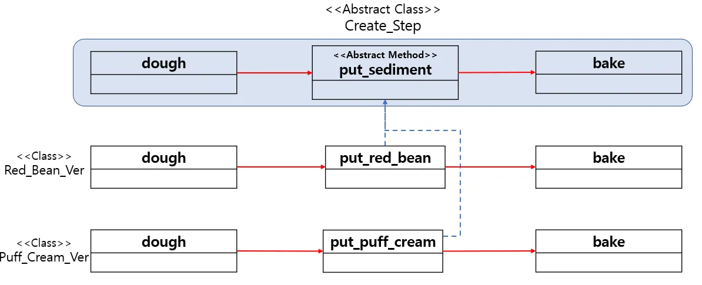
    

**🟢 장점: 중복 제거와 제어**

**1. 코드 중복을 획기적으로 줄인다 (DRY)**

- 공통 로직을 상위 클래스에 한 번만 작성하면 되므로 유지보수가 매우 쉬워집니다.

**2. 자식 클래스의 역할을 축소시킨다**

- 자식 클래스는 거대한 흐름을 몰라도, 자기에게 맡겨진 `putFilling()` 하나만 구현하면 됩니다.

**🔴 단점: 상속의 족쇄**

**1. 상속(Inheritance)을 사용해야 한다**

- 자바에서 상속은 가장 강한 결합입니다. 부모 클래스가 바뀌면 자식 클래스도 영향을 받습니다.
- 또한, 이미 다른 클래스를 상속받고 있다면 이 패턴을 적용하기 어렵습니다.

**라이브러리와 프레임워크의 차이 (IoC)**

- 스프링의 `DispatcherServlet`이나 각종 `XxxTemplate` 클래스들이 "흐름은 내가 제어할 테니, 너는 비즈니스 로직만 채워 넣어"라고 하는 방식입니다.

---

### 템플릿 메서드 vs 팩토리 메서드

둘 다 **"자식에게 위임한다(Inheritance)"**는 점은 같지만, 목적이 다릅니다.

| **구분** | **템플릿 메서드 패턴** | **팩토리 메서드 패턴** |
| --- | --- | --- |
| **목적** | **행동(Behavior)**의 일부분을 수정 | **생성(Creation)**의 대상을 결정 |
| **대상** | 알고리즘의 특정 **단계(Step)** | 객체의 **인스턴스(Instance)** |
| **질문** | "라면 끓이는 과정 중 **스프는 뭘 넣을까?**" | "오늘 점심 메뉴로 **짜장면을 만들까 짬뽕을 만들까?**" |

---

## 📤 방문자 패턴(Visitor Pattern)

박물관에 있는 유물들은 그대로지만, 그곳을 방문하는 사람에 따라 하는 행동은 다릅니다.

- **관람객:** 구경하고 사진을 찍음.
- **청소부:** 먼지를 털고 닦음.
- **도둑:** 몰래 훔쳐감.

유물(객체)을 수정하지 않고도, 누가 방문하느냐(Visitor)에 따라 새로운 행동을 추가할 수 있는 패턴. 바로 **방문자 패턴**입니다.

> "데이터 구조(Data Structure)와 연산(Operation)을 분리하여, 데이터 구조를 변경하지 않고도 새로운 연산을 추가할 수 있게 하는 패턴"
> 

일반적인 객체지향에서는 "객체 안에 메소드(행동)"를 넣습니다. 하지만 방문자 패턴은 **"객체는 문만 열어주고(`accept`), 행동은 방문자(`Visitor`)가 와서 한다"**는 역발상 패턴입니다.

**◼ 언제 사용하나요? (Why?)**

**1. 자료 구조는 거의 안 변하는데, 기능(연산)만 자꾸 추가될 때**

- **상황:** 쇼핑몰의 '상품' 클래스 구조는 고정되어 있는데, '할인 적용', '배송비 계산', '재고 파악' 등 상품을 가지고 계산해야 할 로직이 계속 늘어날 때 사용합니다.

**2. 데이터 구조와 알고리즘을 분리하고 싶을 때**

- 핵심 비즈니스 데이터 객체(Entity)를 순수하게 유지하고, 복잡한 로직은 Visitor 클래스로 빼내고 싶을 때 유용합니다.

- 예제코드

```java
//Element 인터페이스 정의//
public interface Store{
	void accept(Visitor v):
}

//Element 인터페이스 구현//
public class ConvenientStore implements Store{
	void accept(Visitor v){
    	System.out.println("편의점 방문 허가");
        v.visit(this);
    }
}

//Element 인터페이스 구현//
public class ShoesStore implements Store{
	void accept(Visitor v){
    	System.out.println("신발가게 방문 허가");
        v.visit(this);
    }
}

```

```java
//Visitor 인터페이스 정의//
public interface Visitor{
	void visit(ConvenientStore c);
	void visit(ShoesStore s);
}

//Visitor 인터페이스 구현//
public class Customer implements Visitor{
	void visit(ConvenientStore c){
    	System.out.println("편의점에서 물건 사기");
    }
	void visit(ShoesStore s){
    	System.out.println("신발가게에서 신발 사기");
    ]
}

//Visitor 인터페이스 구현//
public class EyeShopper implements Visitor{
	void visit(ConvenientStore c){
    	System.out.println("편의점에서 물건 구경하기");
    }
	void visit(ShoesStore s){
    	System.out.println("신발가게에서 신발 구경하기");
    }
}

```

```java
//테스트 코드//
public class VisitorPatternTest{
	public static void main(String[] args){
    	Store c = new ConvenientStore();
      Store s = new ShoesStore();

    	Visitor v1 = new Customer();
      Visitor v2 = new EyeShopper();

        c.accept(v1);
        s.accept(v2);
    }
}

//출력//
편의점에서 물건 사기
신발가게에서 신발 구경하기

```

- 예제코드 UML
    
    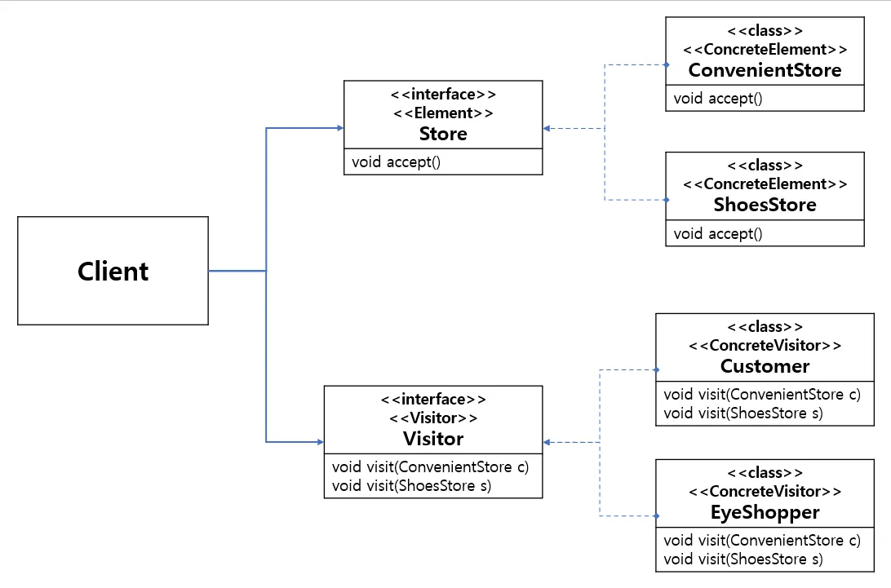
    

**🟢 장점: 기능 확장의 자유**

**1. 기존 코드를 수정하지 않고 새로운 기능을 추가할 수 있다 (OCP)**

- `Element` 클래스는 건드리지 않고, 새로운 `Visitor` 클래스(예: `ExportVisitor`)만 만들면 됩니다.

**2. 관련된 작업(알고리즘)을 한곳에 모을 수 있다**

- 여러 클래스에 흩어져 있던 로직을 하나의 Visitor 클래스로 모을 수 있어 응집도가 높아집니다.

**🔴 단점: 구조 변경의 어려움**

**1. 새로운 요소(Element)를 추가하기가 매우 어렵다**

- 만약 박물관에 '새로운 전시관'이 생긴다면? 모든 종류의 방문자(관람객, 청소부, 도둑...) 코드에 가서 "새 전시관에서는 뭐 할 건지" 로직을 다 추가해야 합니다.

**2. 코드가 복잡하고 이해하기 어렵다 (더블 디스패치)**

- "나를 받아줘(`accept`)" → "그럼 내가 너를 방문할게(`visit`)"로 이어지는 호출 구조(Double Dispatch)가 직관적이지 않아 초심자가 이해하기 힘듭니다.